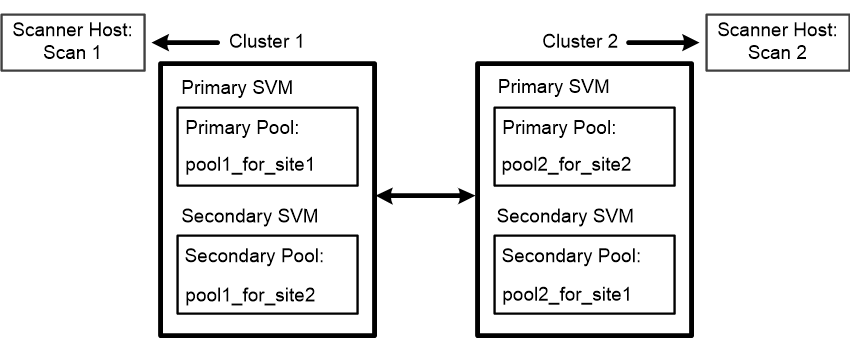

= MetroCluster 구성에서 스캐너 풀을 생성합니다
:icons: font
:imagesdir: ../media/

[role="lead"]
클러스터의 운영 및 2차 SVM에 해당하는 MetroCluster 구성의 각 클러스터에 기본 및 2차 스캐너 풀을 생성해야 합니다.

.무엇을 &#8217;필요로 할거야
* SVM과 Vscan 서버는 동일한 도메인 또는 신뢰할 수 있는 도메인에 있어야 합니다.
* 개별 SVM용으로 정의된 스캐너 풀의 경우 ONTAP 바이러스 백신 커넥터를 SVM 관리 LIF 또는 SVM 데이터 LIF로 구성해야 합니다.
* 클러스터의 모든 SVM에 대해 정의된 스캐너 풀의 경우 클러스터 관리 LIF에서 ONTAP 바이러스 백신 커넥터를 구성해야 합니다.

MetroCluster 구성은 물리적으로 분리된 2개의 미러링된 클러스터를 구현하여 데이터를 보호합니다. 각 클러스터는 다른 클러스터의 데이터와 SVM 구성을 동기식으로 복제합니다. 로컬 클러스터의 1차 SVM은 클러스터가 온라인 상태일 때 데이터를 제공합니다. 로컬 클러스터의 2차 SVM은 원격 클러스터가 오프라인일 때 데이터를 제공합니다.

즉, 클러스터의 1차 및 2차 SVM에 해당하는 MetroCluster 구성의 각 클러스터에 1차 및 2차 스캐너 풀을 생성해야 합니다. 2차 풀은 클러스터에서 2차 SVM의 데이터 서비스를 시작할 때 활성화됩니다. 다음 그림에서는 일반적인 MetroCluster 구성을 보여 줍니다.

[NOTE]
====
권한이 있는 사용자 목록에는 Vscan 서버가 SVM에 연결하는 데 사용하는 도메인 사용자 계정이 포함되어야 합니다.

====
.단계
. 스캐너 풀 생성:
+
'vserver vscan scanner -pool create -vserver data_SVM|cluster_admin_SVM-scanner -pool scanner_pool -hostname vscan_server_hostname -privileged-users privileged_users'

+
** 개별 SVM용으로 정의된 풀에 대해 데이터 SVM을 지정하고, 클러스터의 모든 SVM에 대해 정의된 풀에 대해 클러스터 관리 SVM을 지정합니다.
** 각 Vscan 서버 호스트 이름에 대한 IP 주소 또는 FQDN을 지정합니다.
** 권한이 있는 각 사용자의 도메인 및 사용자 이름을 지정합니다.

+
[NOTE]
====
운영 SVM이 포함된 클러스터에서 모든 스캐너 풀을 생성해야 합니다.

====
+
전체 옵션 목록은 명령에 대한 man 페이지를 참조하십시오.

+
다음 명령을 실행하면 MetroCluster 구성의 각 클러스터에 운영 및 2차 스캐너 풀이 생성됩니다.

+
[listing]
----
cluster1::> vserver vscan scanner-pool create -vserver cifssvm1 -
scanner-pool pool1_for_site1 -hostnames scan1 -privileged-users cifs
\u1,cifs\u2

cluster1::> vserver vscan scanner-pool create -vserver cifssvm1 -
scanner-pool pool1_for_site2 -hostnames scan1 -privileged-users cifs
\u1,cifs\u2

cluster1::> vserver vscan scanner-pool create -vserver cifssvm1 -
scanner-pool pool2_for_site1 -hostnames scan2 -privileged-users cifs
\u1,cifs\u2

cluster1::> vserver vscan scanner-pool create -vserver cifssvm1 -
scanner-pool pool2_for_site2 -hostnames scan2 -privileged-users cifs
\u1,cifs\u2
----
. 스캐너 풀이 생성되었는지 확인합니다. 'vserver vscan scanner -pool show -vserver data_SVM|cluster_admin_SVM-scanner -pool scanner_pool'
+
전체 옵션 목록은 명령에 대한 man 페이지를 참조하십시오.

+
다음 명령을 실행하면 스캐너 풀 'pool1'에 대한 세부 정보가 표시됩니다.

+
[listing]
----
cluster1::> vserver vscan scanner-pool show -vserver cifssvm1 -scanner-pool pool1_for_site1

                                    Vserver: cifssvm1
                               Scanner Pool: pool1_for_site1
                             Applied Policy: idle
                             Current Status: off
         Cluster on Which Policy Is Applied: -
                  Scanner Pool Config Owner: vserver
       List of IPs of Allowed Vscan Servers:
List of Host Names of Allowed Vscan Servers: scan1
                   List of Privileged Users: cifs\u1,cifs\u2
----
+
SVM에서 모든 스캐너 풀을 보려면 'vserver vscan scanner -pool show' 명령을 사용할 수도 있습니다. 전체 명령 구문은 명령에 대한 man 페이지를 참조하십시오.

