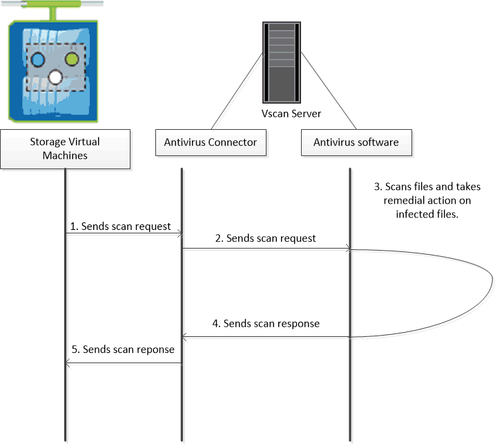

= NetApp 바이러스 검사 정보
:icons: font
:imagesdir: ../media/

[role="lead"]
NetApp 스토리지 시스템에서 통합 바이러스 백신 기능을 사용하여 바이러스나 기타 악성 코드에 의해 데이터가 손상되는 것을 방지할 수 있습니다. NetApp 바이러스 검사(_Vscan_)는 업계 최고의 타사 바이러스 백신 소프트웨어와 ONTAP 기능을 결합하여 검사 대상 파일과 시기를 제어하는 데 필요한 유연성을 제공합니다.

== 바이러스 검사 작동 방식

스토리지 시스템은 타사 공급업체의 안티바이러스 소프트웨어를 호스팅하는 외부 서버로 검사 작업을 오프로드합니다. NetApp에서 제공하고 외부 서버에 설치된 ONTAP 바이러스 백신 커넥터는 스토리지 시스템과 바이러스 백신 소프트웨어 간의 통신을 처리합니다.

* 액세스 시 검사 _ 를 사용하여 클라이언트가 SMB를 통해 파일을 열거나 읽거나 이름을 바꾸거나 닫을 때 바이러스를 검사할 수 있습니다. 외부 서버가 파일의 스캔 상태를 보고할 때까지 파일 작업이 일시 중단됩니다. 파일이 이미 스캔되면 ONTAP에서 파일 작업을 허용합니다. 그렇지 않으면 서버에서 스캔을 요청합니다.
+
액세스 시 스캐닝은 NFS에서 지원되지 않습니다.

* 주문형 검사 _ 을(를) 사용하여 파일에 바이러스가 있는지 즉시 또는 일정에 따라 확인할 수 있습니다. 예를 들어, 사용량이 적은 시간에만 스캔을 실행할 수 있습니다. 외부 서버는 선택한 파일의 스캔 상태를 업데이트하므로 SMB를 통해 다음에 액세스할 때 해당 파일의 파일 액세스 지연 시간이 일반적으로 줄어듭니다.
+
NFS를 통해서만 내보낸 볼륨에서도 SVM 네임스페이스에서 모든 경로에 대해 온디맨드 스캐닝을 사용할 수 있습니다.

일반적으로 SVM에서 두 스캐닝 모드를 모두 사용할 수 있습니다. 어느 모드에서든 바이러스 백신 소프트웨어는 소프트웨어의 설정에 따라 감염된 파일에 대한 치료 조치를 취합니다.

