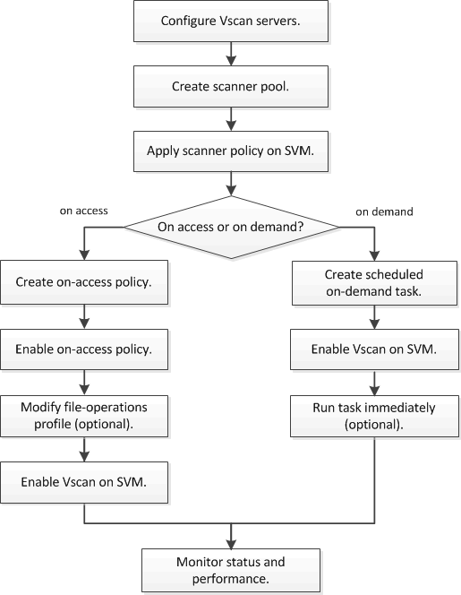

= 바이러스 검사 워크플로
:allow-uri-read: 
:icons: font
:imagesdir: ../media/

[role="lead"]
스캔을 활성화하기 전에 스캐너 풀을 생성하고 스캐너 정책을 적용해야 합니다. 일반적으로 SVM에서 액세스 시 스캔과 온디맨드 스캐닝을 모두 수행할 수 있습니다.

[NOTE]
====
CIFS 구성을 완료해야 합니다.

====

