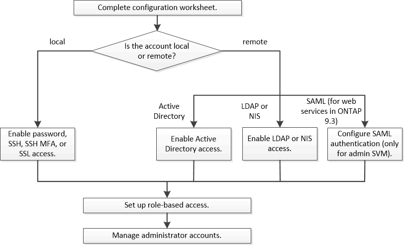

= 관리자 인증 및 RBAC 워크플로
:icons: font
:imagesdir: ../media/

[role="lead"]
로컬 관리자 계정 또는 원격 관리자 계정에 대해 인증을 설정할 수 있습니다. 로컬 계정의 계정 정보는 스토리지 시스템에 있으며 원격 계정의 계정 정보는 다른 위치에 있습니다. 각 계정에는 미리 정의된 역할 또는 사용자 지정 역할이 있을 수 있습니다.

로컬 관리자 계정이 다음 유형의 인증을 통해 SVM(관리 스토리지 가상 시스템) 또는 데이터 SVM에 액세스할 수 있도록 설정할 수 있습니다.

* 암호
* SSH 공개 키
* SSL 인증서
* SSH 다단계 인증(MFA)
+
ONTAP 9.3부터 암호 및 공개 키로 인증이 지원됩니다.

원격 관리자 계정에서 다음 인증 유형을 사용하여 관리 SVM 또는 데이터 SVM에 액세스할 수 있습니다.

* Active Directory를 클릭합니다
* SAML 인증(관리 SVM에만 해당)
+
ONTAP 9.3부터 SAML(Security Assertion Markup Language) 인증은 서비스 프로세서 인프라, ONTAP API 또는 System Manager 웹 서비스를 사용하여 관리 SVM에 액세스하는 데 사용할 수 있습니다.

* ONTAP 9.4부터 SSH MFA를 LDAP 또는 NIS 서버의 원격 사용자에게 사용할 수 있습니다. nsswitch 및 공개 키를 사용한 인증이 지원됩니다.

