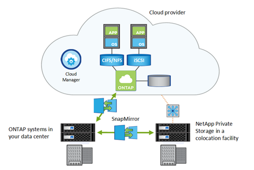

= 데이터 복제
:allow-uri-read: 
:icons: font
:imagesdir: ../media/

[role="lead"]
SnapMirror 기술은 ONTAP 스냅샷 복사본을 사용하여 사내 설치와 클라우드 설치 간에 데이터를 동기화된 상태로 유지합니다. SnapMirror는 변경된 데이터만 대상 복제본에 전송되도록 블록 레벨 증분 데이터 전송을 수행합니다.

마찬가지로, SnapMirror 볼트 관계를 사용하여 Cloud Volumes ONTAP 시스템에 작성된 로컬 스냅샷 복사본에 대한 데이터 아카이브를 생성할 수 있습니다.

NetApp Cloud Backup은 데이터를 보호하고 클라우드의 오브젝트 스토리지에 보관하기 위한 완벽하고 비용 효율적인 백업 및 복원 기능을 제공합니다. Cloud Backup은 클라우드 기반 데이터 및 사내 데이터에 모두 사용할 수 있습니다.

https://tv.netapp.com/detail/video/6056551157001/setup-a-disaster-recovery-copy-with-in-the-cloud-with-netapp-cloud-volumes-ontap?autoStart=true&page=1&q=ontap%20cloud["Cloud Volumes ONTAP를 사용하여 클라우드에서 재해 복구 설정"]

https://cloud.netapp.com/blog/simplified-disaster-recovery-ontap-cloud-snapmirror["Cloud Volumes ONTAP 및 SnapMirror를 사용한 효율적인 데이터 복제"]

link:../data-protection/index.html["CLI를 사용한 ONTAP 데이터 보호"]

https://cloud.netapp.com/cloud-backup-service["NetApp 클라우드 백업"]
