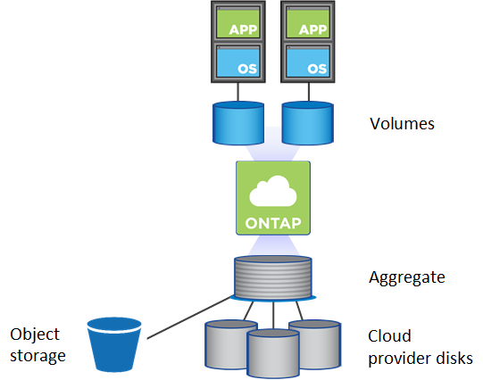

= 볼륨 관리
:allow-uri-read: 
:icons: font
:imagesdir: ../media/

[role="lead"]
유연하고 효율적인 볼륨 관리는 ONTAP 클라우드 솔루션의 핵심입니다. ONTAP FlexVol 볼륨은 클라우드 내부에 구성되어 있는지 여부와 관계없이 동일한 데이터 관리 프로세스를 통해 동일한 Data Fabric 이점을 제공합니다. 또한 클라우드 기능을 활용하여 워크로드를 신속하게 확장하고, 필요에 따라 용량을 늘리거나 줄일 수 있습니다.

클라우드 볼륨은 중복제거, 압축, 컴팩션, 씬 프로비저닝, 데이터 계층화와 같은 온프레미스 볼륨과 동일한 스토리지 효율성을 제공합니다. 클라우드 환경에서 기본 클라우드 디스크 사용에 대한 비용은 줄어듭니다.

클라우드에서 볼륨을 프로비저닝하는 방법에는 2가지가 있습니다.

* 새 클라우드 볼륨을 생성합니다.
* SnapMirror 기술 또는 Cloud Sync 서비스를 사용하여 기존 온프레미스 볼륨을 새 클라우드 볼륨 대상에 복제합니다.

https://docs.netapp.com/us-en/occm/task_provisioning_storage.html["Cloud Manager: 스토리지 프로비저닝"]

https://docs.netapp.com/us-en/occm/task_manage_anf.html["Azure NetApp Files의 볼륨 관리"]

https://docs.netapp.com/us-en/occm/task_manage_cvs_aws.html["Cloud Volumes Service for AWS 관리"]

https://cloud.netapp.com/cloud-sync-service["Cloud Sync 서비스"]
