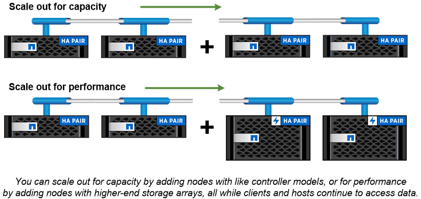

= 클러스터 스토리지
:allow-uri-read: 
:icons: font
:imagesdir: ../media/

[role="lead"]
ONTAP의 현재 반복은 원래 NetApp의 스케일아웃_클러스터_스토리지 아키텍처용으로 개발되었습니다. 이 아키텍처는 ONTAP의 데이터 센터 구현에서 일반적으로 볼 수 있는 아키텍처입니다. 이 구축 과정에서는 ONTAP의 대부분의 기능을 사용하기 때문에 ONTAP 기술에 대한 개념을 이해하는 것이 좋습니다.

데이터 센터 아키텍처는 일반적으로 ONTAP 데이터 관리 소프트웨어를 실행하는 전용 FAS 또는 AFF 컨트롤러를 구축합니다. 각 컨트롤러, 스토리지, 네트워크 연결 및 컨트롤러에서 실행되는 ONTAP 인스턴스를 _node._라고 합니다

HA(고가용성)를 위해 노드가 페어링되었습니다. 이 두 쌍(SAN의 경우 최대 12개 노드, NAS의 경우 최대 24개 노드)이 클러스터를 구성합니다. 노드는 전용 클러스터 인터커넥트를 통해 서로 통신합니다.

컨트롤러 모델에 따라 노드 스토리지는 플래시 디스크, 용량 드라이브 또는 둘 모두로 구성됩니다. 컨트롤러의 네트워크 포트는 데이터에 대한 액세스를 제공합니다. 물리적 스토리지 및 네트워크 연결 리소스는 가상화되어 클러스터 관리자만 볼 수 있고 NAS 클라이언트 또는 SAN 호스트에는 표시되지 않습니다.

HA 쌍의 노드는 동일한 스토리지 어레이 모델을 사용해야 합니다. 그렇지 않으면 지원되는 모든 컨트롤러 조합을 사용할 수 있습니다. 스토리지 어레이 모델과 같은 노드를 추가하거나 하이엔드 스토리지 어레이가 포함된 노드를 추가하여 성능을 위해 용량을 확장할 수 있습니다.

물론 필요에 따라 디스크 또는 컨트롤러를 업그레이드하면서 기존의 모든 방법으로 스케일업할 수 있습니다. ONTAP의 가상화 스토리지 인프라를 사용하면 데이터를 중단 없이 쉽게 이동할 수 있으므로 다운타임 없이 수직 또는 수평으로 확장할 수 있습니다.

