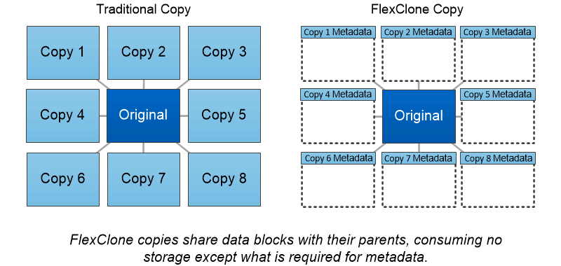

= FlexClone 볼륨, 파일 및 LUN을 사용할 수 있습니다
:allow-uri-read: 
:icons: font
:imagesdir: ../media/

[role="lead"]
_FlexClone_기술은 Snapshot 메타데이터를 참조하여 볼륨의 쓰기 가능한 특정 시점 복사본을 생성합니다. 복사본은 데이터 블록을 부모님과 공유하므로 변경 사항이 복사본에 기록될 때까지 메타데이터에 필요한 것만 제외하고 스토리지가 필요하지 않습니다. FlexClone 파일 및 FlexClone LUN은 스냅샷 복사본을 백업할 필요가 없다는 점을 제외하고 동일한 기술을 사용합니다.

FlexClone 소프트웨어를 사용하면 기존 복사본을 생성하는 데 몇 분 또는 몇 시간이 걸릴 수 있으며 최대 규모의 데이터 세트도 거의 즉시 복사할 수 있습니다. 따라서 동일한 데이터 세트의 여러 복사본(예: 가상 데스크톱 구축)이 필요하거나 데이터 세트의 임시 복사본(운영 데이터 세트에 대해 애플리케이션 테스트)이 필요한 경우에 적합합니다.

기존 FlexClone 볼륨을 클론 복제하거나, LUN 클론을 포함하는 볼륨을 클론 복제하거나, 미러 및 소산 데이터를 클론 복제할 수 있습니다. 부모로부터 FlexClone 볼륨을 _split_할 수 있습니다. 이 경우 사본이 자체 스토리지를 할당하게 됩니다.

