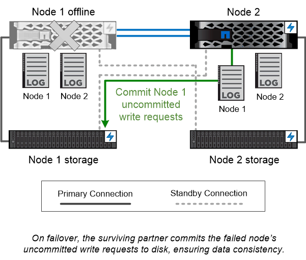

= 고가용성 쌍
:allow-uri-read: 
:icons: font
:imagesdir: ../media/

[role="lead"]
클러스터 노드는 내결함성 및 무중단 운영을 위해 _ HA(고가용성) 쌍으로 구성됩니다. 노드에 장애가 발생할 경우 또는 정기적인 유지보수를 위해 노드를 구축해야 하는 경우 파트너는 스토리지를 _ 테이크오버하고 해당 스토리지에서 데이터를 계속 제공할 수 있습니다. 노드가 다시 온라인 상태가 되면 PARTNER_에서 BACK_STORAGE를 제공합니다.

HA 쌍은 항상 같은 컨트롤러 모델로 구성됩니다. 일반적으로 컨트롤러는 중복 전원 공급 장치가 있는 동일한 섀시에 위치합니다.

HA 쌍은 서로 다른 방식으로 통신할 수 있는 내결함성 노드로서, 각 노드가 파트너의 작동 여부를 지속적으로 확인하고 다른 노드의 비휘발성 메모리에 대한 로그 데이터를 미러링할 수 있습니다. 노드에 대한 쓰기 요청이 수행되면 두 노드의 NVRAM에 기록된 후에 응답이 클라이언트 또는 호스트로 다시 전송됩니다. 페일오버 시, 정상적인 파트너는 장애가 발생한 노드의 커밋되지 않은 쓰기 요청을 디스크에 커밋하여 데이터 정합성을 보장합니다.

다른 컨트롤러의 스토리지 미디어에 연결하면 테이크오버가 수행되는 경우 각 노드가 다른 컨트롤러의 스토리지에 액세스할 수 있습니다. 네트워크 경로 페일오버 메커니즘을 통해 클라이언트 및 호스트가 정상 작동하는 노드와 계속 통신할 수 있습니다.

가용성을 보장하기 위해 페일오버 사례에 추가 워크로드를 수용할 수 있도록 두 노드 중 하나의 성능 용량 활용률을 50%로 유지해야 합니다. 같은 이유로 노드에 대한 최대 NAS 가상 네트워크 인터페이스 수의 50% 이상을 구성하려고 할 수 있습니다.

|===

 a| 
가상화 ONTAP 구축 환경에서 * _테이크오버와 반환 _ *

ONTAP for AWS나 ONTAP Select 같은 가상화된 "무공유" Cloud Volumes ONTAP 구축 환경에서 스토리지가 노드 간에 공유되지 않습니다. 노드가 중단되면 파트너는 노드 데이터의 동기식 미러링된 복사본을 통해 데이터를 계속 제공합니다. 이 노드는 노드의 스토리지를 이어받지 않으며 데이터 서비스 기능만 제공합니다.

|===