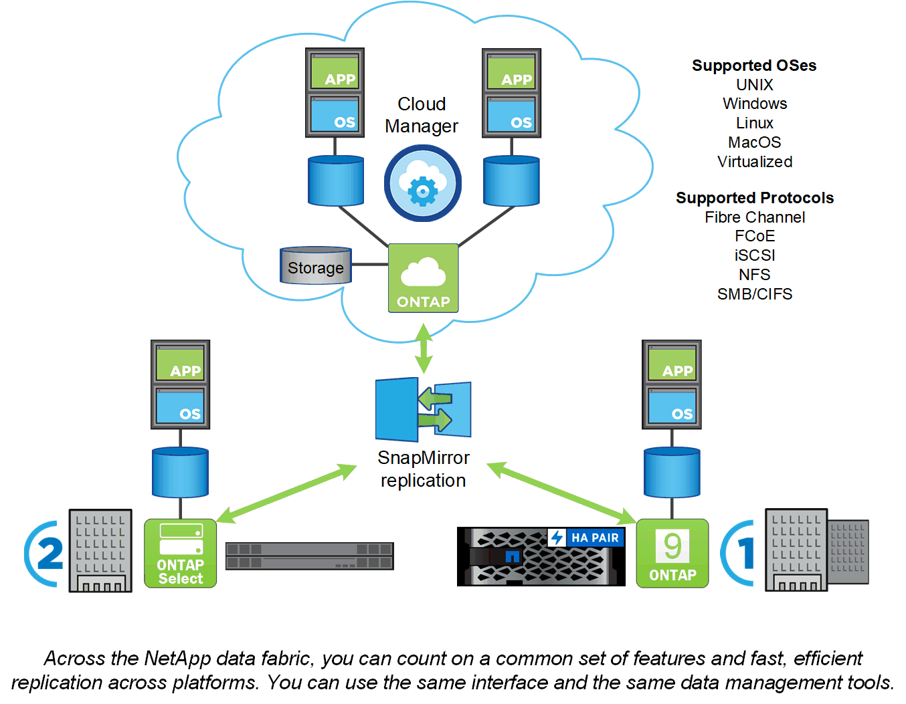

= ONTAP 플랫폼
:allow-uri-read: 
:icons: font
:imagesdir: ../media/

[role="lead"]
ONTAP 데이터 관리 소프트웨어는 고속 플래시, 저렴한 회전식 미디어, 클라우드 기반 오브젝트 스토리지 등 스토리지 구성에서 블록 또는 파일 액세스 프로토콜을 통해 데이터를 읽고 쓰는 애플리케이션을 위한 유니파이드 스토리지를 제공합니다.

ONTAP 구축은 NetApp 엔지니어링 FAS, AFF 또는 C-Series 어플라이언스, 일반 하드웨어(ONTAP Select), 프라이빗, 퍼블릭 또는 하이브리드 클라우드(NetApp 프라이빗 스토리지 또는 Cloud Volumes ONTAP)에서 실행됩니다. 전문 구현을 통해 동급 최고의 통합 인프라(FlexPod 데이터 센터) 및 타사 스토리지 어레이에 대한 액세스(FlexArray 가상화) 제공

이러한 구현이 결합될 경우 _ NetApp Data Fabric _ 의 기본 프레임워크가 형성되며, 공통 소프트웨어 정의 접근 방식을 통해 데이터 관리와 플랫폼 간 빠르고 효율적인 복제를 실현할 수 있습니다.

.FlexPod 데이터 센터 및 FlexArray 가상화 정보
NetApp Data Fabric의 그림에는 나와 있지 않지만, FlexPod 데이터 센터 및 FlexArray 가상화는 ONTAP의 핵심 구현 요소입니다.

* FlexPod는 동급 최고의 스토리지, 네트워킹 및 컴퓨팅 구성요소를 유연한 엔터프라이즈 워크로드 아키텍처 에 통합합니다. 통합 인프라는 비즈니스 크리티컬 애플리케이션과 클라우드 기반 데이터 센터 인프라를 신속하게 구축할 수 있도록 지원합니다.
* FlexArray은 타사 및 NetApp E-Series 스토리지 어레이를 위한 프런트 엔드로, 일관된 기능 세트와 간소화된 데이터 관리를 제공합니다. FlexArray 시스템은 다른 ONTAP 시스템과 유사하며 동일한 기능을 모두 제공합니다.

