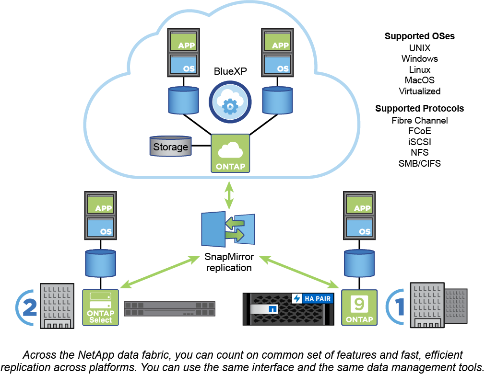

= ONTAP 플랫폼
:allow-uri-read: 
:icons: font
:imagesdir: ../media/

[role="lead"]
ONTAP 데이터 관리 소프트웨어는 고속 플래시, 저렴한 회전식 미디어, 클라우드 기반 오브젝트 스토리지 등 스토리지 구성에서 블록 또는 파일 액세스 프로토콜을 통해 데이터를 읽고 쓰는 애플리케이션을 위한 유니파이드 스토리지를 제공합니다.

ONTAP 구현은 NetApp 엔지니어링 FAS, AFF A-Series 및 C-Series, All-SAN Flash Array ASA 플랫폼뿐만 아니라 일반 하드웨어(ONTAP Select)와 프라이빗, 퍼블릭 또는 하이브리드 클라우드(Cloud Volumes ONTAP)에서 실행됩니다. 전문화된 구현은 업계 최고의 컨버지드 인프라(FlexPod Datacenter)를 제공합니다.

이러한 구현이 결합될 경우 _ NetApp Data Fabric _ 의 기본 프레임워크가 형성되며, 공통 소프트웨어 정의 접근 방식을 통해 데이터 관리와 플랫폼 간 빠르고 효율적인 복제를 실현할 수 있습니다.

