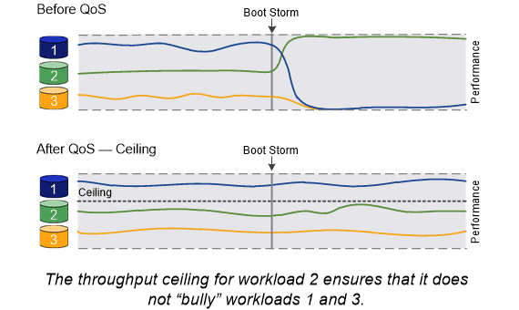
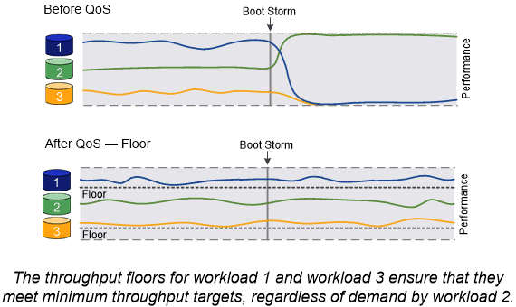

= 로드 밸런싱
:allow-uri-read: 
:icons: font
:imagesdir: ../media/

[role="lead"]
노드의 작업 양이 사용 가능한 리소스를 초과하면 워크로드의 성능이 지연 시간의 영향을 받기 시작합니다. 사용 가능한 리소스를 증가(디스크 또는 CPU 업그레이드)하거나 로드를 감소(필요에 따라 볼륨 또는 LUN을 다른 노드로 이동)하여 과부하된 노드를 관리할 수 있습니다.

또한 ONTAP_스토리지 QoS(Quality of Service)_를 사용하여 중요한 워크로드의 성능이 다른 워크로드에 의해 저하되지 않도록 보장할 수 있습니다.

* 경쟁 워크로드에 QoS throughput_ceiling_을 설정하여 시스템 리소스에 미치는 영향을 제한할 수 있습니다(QoS Max).
* 중요 워크로드에 대해 QoS throughput_floor_를 설정하여 경쟁업체 워크로드(QoS Min)를 통해 수요에 관계없이 최소 처리량 목표를 충족할 수 있도록 합니다.
* 동일한 워크로드에 대해 QoS 상한과 최저값을 설정할 수 있습니다.

== 처리량 천정

처리량 상한은 워크로드의 처리량을 최대 IOPS 또는 MB/s로 제한합니다 아래 그림에서 워크로드 2의 처리량 상한은 워크로드 1과 3의 "불운" 워크로드가 되지 않도록 합니다.

policy group_은 하나 이상의 워크로드에 대한 처리량 한도를 정의합니다. 워크로드는 _ 스토리지 객체에 대한 입출력 작업을 나타냅니다. _ 볼륨, 파일 또는 LUN 또는 SVM의 모든 볼륨, 파일 또는 LUN입니다. 정책 그룹을 생성할 때 상한을 지정하거나 워크로드를 모니터링하여 지정할 때까지 기다릴 수 있습니다.

[NOTE]
====
워크로드에 대한 처리량은 지정된 최대 10%까지 초과할 수 있으며, 특히 워크로드에 처리량이 급격하게 변경될 경우 더욱 그렇습니다. 천장은 버스트를 처리하기 위해 최대 50%까지 초과될 수 있습니다.

====

== 처리량 층

처리량 한도 에서는 워크로드의 처리량이 최소 IOPS 미만으로 떨어지지 않도록 보장합니다. 아래 그림에서 워크로드 1과 워크로드 3의 처리량 플로어는 워크로드 2의 수요에 관계없이 최소 처리량 목표를 충족할 수 있도록 합니다.

[TIP]
====
예를 들어, 처리량 상한은 처리량을 직접 조절합니다. 처리량 플로어에서는 플로어가 설정된 워크로드에 우선 순위를 부여하여 간접적으로 처리량을 조절합니다.

====
워크로드는 ONTAP 9.3 파일부터 볼륨, LUN 또는 파일에 대한 I/O 작업을 나타냅니다. 처리량 플로어를 정의하는 정책 그룹은 SVM에 적용할 수 없습니다. 정책 그룹을 생성할 때 층을 지정하거나 워크로드를 모니터링하여 지정할 때까지 기다릴 수 있습니다.

[NOTE]
====
노드나 애그리게이트에 성능 용량(여유 공간)이 충분하지 않거나 '볼륨 이동 트리거-컷오버'와 같은 중요 운영 중에 워크로드에 대한 처리량이 지정된 바닥 아래로 떨어질 수 있습니다. 충분한 용량을 사용할 수 있고 중요한 작업이 마련되어 있지 않더라도 워크로드에 대한 처리량은 지정된 설치 공간 아래로 최대 5% 떨어질 수 있습니다.

====

== 적응형 QoS

일반적으로 스토리지 객체에 할당한 정책 그룹의 값은 고정됩니다. 스토리지 오브젝트의 크기가 변경되면 값을 수동으로 변경해야 합니다. 예를 들어, 볼륨에 사용된 공간의 양을 늘리려면 일반적으로 볼륨에 지정된 처리량 상한을 늘려야 합니다.

_Adaptive QoS_는 워크로드 크기에 따라 정책 그룹 값을 자동으로 확장하며 워크로드 크기 변화에 따라 IOPS와 TB|GB의 비율을 유지합니다. 이는 대규모 구축 환경에서 수백 또는 수천 개의 워크로드를 관리할 때 큰 이점입니다.

일반적으로 적응형 QoS를 사용하여 처리량 한도를 조정할 수 있지만 워크로드 크기가 증가하는 경우 이를 사용하여 처리량 플로어를 관리할 수도 있습니다. 워크로드 크기는 스토리지 객체에 할당된 공간 또는 스토리지 객체가 사용하는 공간으로 표시됩니다.

NOTE: ONTAP 9.5 이상의 처리량 층에서는 사용된 공간을 사용할 수 있습니다. ONTAP 9.4 및 이전 버전의 처리량 바닥재에서는 지원되지 않습니다.

+ONTAP 9.13.1 부터는 적응형 QoS를 사용하여 SVM 레벨에서 처리량 바닥과 천장을 설정할 수 있습니다.

* allocated space_policy는 스토리지 객체의 공칭 크기에 따라 IOPS/TB|GB 비율을 유지합니다. 비율이 100 IOPS/GB인 경우, 볼륨이 해당 크기로 유지되는 한 150 GB 볼륨의 처리량은 최대 15,000 IOPS입니다. 볼륨의 크기를 300GB로 변경하면 적응형 QoS는 처리량의 상한을 30,000 IOPS로 조정합니다.
* a_used space_policy(기본값)는 스토리지 효율성 이전에 저장된 실제 데이터의 양에 따라 IOPS/TB|GB 비율을 유지합니다. 비율이 100 IOPS/GB인 경우 100GB 데이터가 저장된 150GB 볼륨의 처리량은 최대 10,000 IOPS입니다. 사용된 공간의 양이 변경되면 적응형 QoS는 비율에 따라 처리량 상한을 조정합니다.

