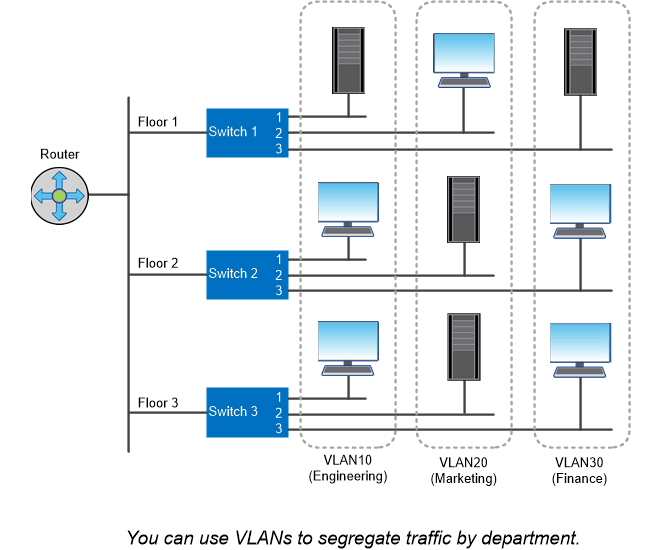

= 논리 포트
:allow-uri-read: 
:icons: font
:imagesdir: ../media/

[role="lead"]
각 노드에 제공되는 물리적 포트 외에 _logical port_를 사용하여 네트워크 트래픽을 관리할 수 있습니다. 논리 포트는 인터페이스 그룹 또는 VLAN입니다.

== 인터페이스 그룹

_인터페이스 그룹_ 여러 개의 물리적 포트를 하나의 논리적 ""트렁크 포트"로 결합합니다. 다른 PCI 슬롯에 있는 NIC의 포트로 구성된 인터페이스 그룹을 만들어 슬롯 장애가 발생하여 업무상 중요한 트래픽이 감소되도록 할 수 있습니다.

인터페이스 그룹은 단일 모드, 다중 모드 또는 동적 다중 모드일 수 있습니다. 각 모드는 다양한 수준의 내결함성을 제공합니다. 두 유형의 다중 모드 인터페이스 그룹을 사용하여 네트워크 트래픽의 로드 밸런싱을 수행할 수 있습니다.

== VLAN

_VLANs_물리적 경계가 아닌 스위치 포트 기반에 정의된 논리 세그먼트로 네트워크 포트(인터페이스 그룹)에서 트래픽을 분리합니다. VLAN에 속한 _end-stations_는 기능 또는 애플리케이션에 의해 관련된다.

엔지니어링 및 마케팅 등의 부서나 릴리스1 및 릴리스2 등의 프로젝트별로 최종 스테이션을 그룹화할 수 있습니다. 최종 스테이션의 물리적 근접성이 VLAN에서 무관하기 때문에 최종 스테이션은 지리적으로 원격일 수 있습니다.

