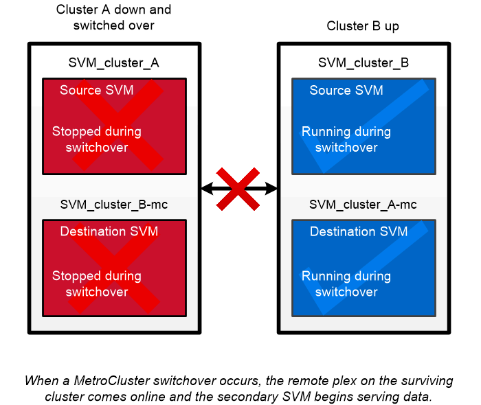

= MetroCluster 지속적인 가용성
:allow-uri-read: 
:icons: font
:imagesdir: ../media/

[role="lead"]
MetroCluster 구성은 물리적으로 분리된 2개의 미러링된 클러스터를 구현하여 데이터를 보호합니다. 각 클러스터는 다른 클러스터의 데이터와 SVM 구성을 동기식으로 복제합니다. 한 사이트에서 재해가 발생할 경우 관리자는 미러링된 SVM을 활성화하고 정상적인 사이트에서 데이터를 제공할 수 있습니다.

* _패브릭 연결 MetroCluster_ 구성은 대도시 수준의 클러스터를 지원합니다.
* _Stretch MetroCluster_ 구성은 캠퍼스 전체 클러스터를 지원합니다.

클러스터는 어떠한 경우에도 자세히 살펴봐야 합니다.

MetroCluster는 _SyncMirror_라는 ONTAP 기능을 사용하여 각 클러스터의 집계 데이터를 다른 클러스터의 스토리지에서 복사 또는 _Plex_로 동기식으로 미러링합니다. 스위치오버가 발생하면 작동하는 클러스터의 원격 플렉스에서 온라인 상태가 되고 보조 SVM에서 데이터 제공을 시작합니다.

|===

 a| 
* _비 MetroCluster 구축에서 SyncMirror 사용_ * 비 MetroCluster 구현에서 SyncMirror를 선택적으로 사용하여 RAID 유형이 보호하는 것보다 많은 디스크에 장애가 발생하거나 RAID 그룹 디스크에 대한 연결이 손실된 경우 데이터 손실을 방지할 수 있습니다. 이 기능은 HA 쌍에만 사용할 수 있습니다.

애그리게이트 데이터는 다른 디스크 쉘프에 저장된 플렉스로 미러링됩니다. 쉘프 중 하나를 사용할 수 없게 되면 장애 발생 원인을 해결하는 동안 영향을 받지 않는 플렉스가 계속해서 데이터를 제공합니다.

SyncMirror를 사용하여 미러링된 Aggregate는 미러링되지 않은 Aggregate보다 두 배 많은 스토리지가 필요합니다. 각 플렉스에는 플렉스 IT 미러 만큼 많은 디스크가 필요합니다. 예를 들어, 각 플렉스에 1,440GB Aggregate, 1,440GB를 미러링하려면 2,880GB의 디스크 공간이 필요합니다.

[NOTE]
====
SyncMirror는 FlexArray 가상화 구현에도 사용할 수 있습니다.

====
|===