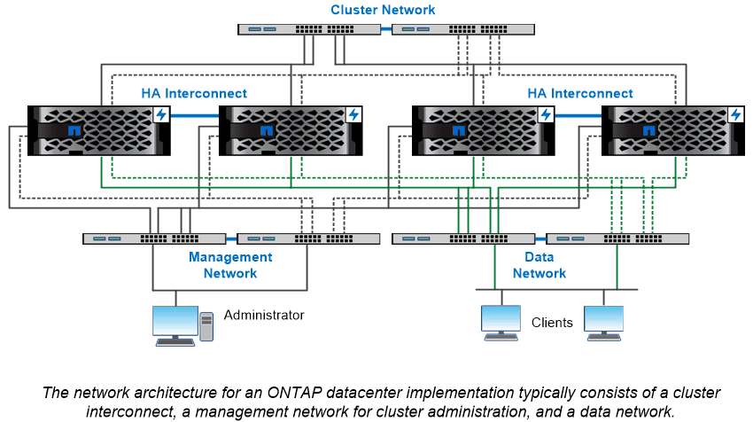

= 네트워크 아키텍처 개요
:icons: font
:imagesdir: ../media/

[role="lead"]
ONTAP 데이터 센터 구축을 위한 네트워크 아키텍처는 일반적으로 클러스터 인터커넥트, 클러스터 관리를 위한 관리 네트워크 및 데이터 네트워크로 구성됩니다. NIC(네트워크 인터페이스 카드)는 이더넷 연결을 위한 물리적 포트를 제공합니다. HBA(호스트 버스 어댑터)는 FC 연결을 위한 물리적 포트를 제공합니다.

