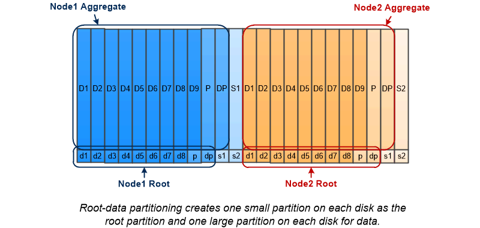

= 루트 데이터 파티셔닝
:allow-uri-read: 
:icons: font
:imagesdir: ../media/

[role="lead"]
모든 노드에는 스토리지 시스템 구성 파일에 대한 루트 애그리게이트가 있어야 합니다. 루트 애그리게이트에는 데이터 애그리게이트의 RAID 유형이 있습니다.

System Manager에서는 루트 데이터 또는 루트 데이터 데이터 파티셔닝을 지원하지 않습니다.

일반적으로 RAID-DP 유형의 루트 애그리게이트는 데이터 디스크 1개와 패리티 디스크 2개로 구성됩니다. 시스템에서 각 RAID 그룹의 패리티 디스크로 두 디스크를 이미 예약하고 있는 경우 스토리지 시스템 파일에 대한 비용을 지불하는 것은 상당한 "패리티 부담"입니다.

_Root - 데이터 파티셔닝 _ 은 디스크 파티션 전체에 루트 애그리게이트를 할당함으로써 패리티 세금을 줄이고 각 디스크에 루트 파티션으로 작은 파티션을 하나, 데이터를 위한 하나의 큰 파티션을 예약합니다.

그림에서 알 수 있듯이 루트 애그리게이트를 저장하는 데 사용되는 디스크가 많을수록 루트 파티션이 작아집니다. 이는 또한 루트 파티션으로 작은 파티션을 하나 만들고 데이터를 위해 크기가 같은 큰 두 개의 파티션을 만드는 _root-data-data partitioning_이라는 루트 데이터 파티션 형태의 경우도 해당됩니다.

image::../media/root-data-data.gif[루트 데이터]

두 가지 유형의 루트 데이터 파티셔닝은 ONTAP_ADP(고급 드라이브 파티셔닝)_기능의 일부입니다. 두 가지 모두 엔트리 레벨 FAS2xxx, FAS9000, FAS8200, FAS80xx 및 AFF 시스템을 위한 루트 데이터 파티셔닝, AFF 시스템만을 위한 루트 데이터 데이터 파티셔닝으로 구성되어 있습니다.
