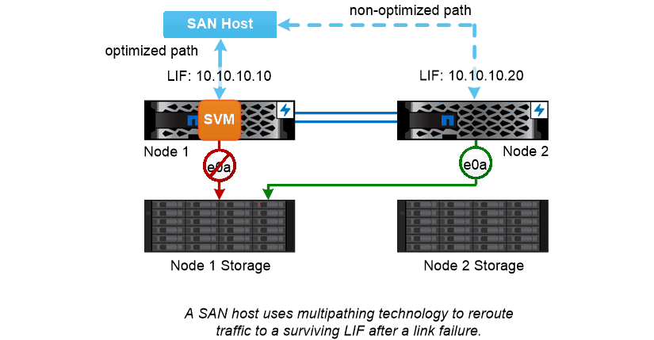

= SAN 경로 페일오버
:allow-uri-read: 
:icons: font
:imagesdir: ../media/

[role="lead"]
SAN 호스트는 ALUA(Asymmetric Logical Unit Access) 및 MPIO(다중 경로 I/O)를 사용하여 링크 장애 후 정상 LIF로 트래픽을 다시 라우팅합니다. 사전 정의된 경로는 SVM이 제공하는 LUN으로 연결되는 가능한 경로를 결정합니다.

SAN 환경에서 호스트는 lun_targets에 대한 요청의 _initiators_로 간주됩니다. _ MPIO 이니시에이터에서 타겟으로의 다중 경로를 활성화합니다. ALUA는 _optimized paths._라고 하는 가장 직접적인 경로를 식별합니다

일반적으로 LUN의 소유 노드에 있는 LIF에 대한 최적화된 경로를 여러 개 구성하고 HA 파트너에 대한 LIF에 최적화되지 않은 경로를 여러 개 구성합니다. 소유 노드에서 포트 중 하나에 장애가 발생하면 호스트는 트래픽을 나머지 포트로 라우팅합니다. 모든 포트에 장애가 발생하면 호스트는 최적화되지 않은 경로를 통해 트래픽을 라우팅합니다.

ONTAP 선택적 LUN 맵(SLM: Selective LUN Map)은 기본적으로 호스트에서 LUN으로의 경로 수를 제한합니다. 새로 생성된 LUN은 LUN 또는 해당 HA 파트너가 속한 노드의 경로를 통해서만 액세스할 수 있습니다. 이니시에이터에 대해 _port set_에서 LIF를 구성하여 LUN에 대한 액세스를 제한할 수도 있습니다.

|===

 a| 
* _SAN 환경에서 볼륨 이동 _ *

기본적으로 ONTAP_선택적 LUN 맵(SLM)_은 SAN 호스트에서 LUN에 대한 경로 수를 제한합니다. 새로 생성된 LUN은 LUN 또는 해당 HA 파트너인 LUN의 _ 보고 노드 _ 에 대한 경로를 통해서만 액세스할 수 있습니다.

즉, 볼륨을 다른 HA 쌍의 노드로 이동할 경우 대상 HA 쌍의 보고 노드를 LUN 매핑에 추가해야 합니다. 그런 다음 MPIO 설정에서 새 경로를 지정할 수 있습니다. 볼륨 이동이 완료된 후 매핑에서 소스 HA 쌍에 대한 보고 노드를 삭제할 수 있습니다.

|===