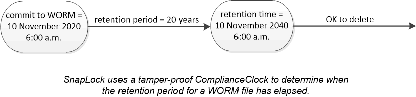

= WORM 스토리지
:icons: font
:imagesdir: ../media/

[role="lead"]
_SnapLock_는 규정 및 거버넌스 목적을 위해 중요한 파일을 수정되지 않은 형태로 유지하기 위해 _WORM(Write Once, Read Many)_ 스토리지를 사용하는 조직을 위한 고성능 규정 준수 솔루션입니다.

단일 라이센스를 사용하면 SEC Rule 17a-4 및 L느슨한_Enterprise 모드와 같은 외부 규정을 충족하기 위해 엄격한_규정 준수 모드에서 SnapLock를 사용할 수 있으며, 디지털 자산 보호를 위해 내부적으로 규정된 규정을 준수할 수 있습니다. SnapLock는 변조 방지 _ComplianceClock_을 사용하여 WORM 파일의 보존 기간이 경과되었는지 확인합니다.

SnapVault _ 에 _SnapLock를 사용하여 보조 스토리지에서 WORM 상태로 스냅샷 복사본을 보호할 수 있습니다. SnapMirror를 사용하여 재해 복구 및 기타 목적으로 WORM 파일을 다른 지리적 위치에 복제할 수 있습니다.

