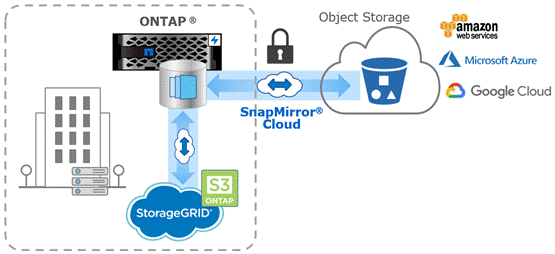

= 오브젝트 스토리지에 SnapMirror Cloud 백업
:icons: font
:imagesdir: ../media/

[role="lead"]
_SnapMirror Cloud_는 데이터 보호 워크플로우를 클라우드로 전환하려는 ONTAP 사용자를 위해 설계된 백업 및 복구 기술입니다. 기존의 테이프 백업 아키텍처에서 벗어나 있는 조직은 오브젝트 스토리지를 장기 데이터 보존 및 아카이빙을 위한 대체 저장소로 사용할 수 있습니다. SnapMirror Cloud는 증분식 영구 백업 전략의 일부로 ONTAP-오브젝트 스토리지 복제를 제공합니다.

SnapMirror Cloud는 ONTAP 9.8에 SnapMirror 복제 기술 제품군의 확장으로 도입되었습니다. SnapMirror는 ONTAP-to-ONTAP 백업에 자주 사용되지만 SnapMirror Cloud는 동일한 복제 엔진을 사용하여 ONTAP의 스냅샷 복사본을 S3 호환 오브젝트 스토리지 백업으로 전송합니다.

백업 사용 사례를 타겟으로 하는 SnapMirror Cloud는 장기 보존 및 아카이브 워크플로우를 모두 지원합니다. SnapMirror와 마찬가지로, 초기 SnapMirror 클라우드 백업은 볼륨의 기본 전송을 수행합니다. 후속 백업의 경우 SnapMirror Cloud는 소스 볼륨의 스냅샷 복사본을 생성하고 변경된 데이터 블록만 포함된 스냅샷 복사본을 오브젝트 스토리지 타겟으로 전송합니다.

SnapMirror 클라우드 관계는 ONTAP 시스템 간에 구성할 수 있으며 AWS S3, Google 클라우드 스토리지 플랫폼, Microsoft Azure Blob Storage를 비롯한 온프레미스 및 퍼블릭 클라우드 오브젝트 스토리지 대상을 선택할 수 있습니다. 추가 사내 오브젝트 스토리지 타겟에는 StoragGRID 및 ONTAP S3가 포함됩니다.

SnapMirror 클라우드 복제는 라이센스가 부여된 ONTAP 기능이며 데이터 보호 워크플로우를 오케스트레이션하기 위해 승인된 애플리케이션이 필요합니다. SnapMirror 클라우드 백업을 관리할 수 있는 몇 가지 오케스트레이션 옵션을 사용할 수 있습니다.

* SnapMirror 클라우드 복제를 지원하는 여러 타사 백업 파트너 참여 공급업체는 에서 이용할 수 있습니다 xref:https://www.netapp.com/blog/new-backup-architecture-snapdiff-v3/[NetApp 블로그].
* ONTAP 환경을 위한 NetApp 기본 솔루션을 위한 Cloud Manager 및 Cloud Backup
* 데이터 보호 워크플로우를 위한 맞춤형 소프트웨어를 개발하거나 자동화 툴을 활용하기 위한 API

