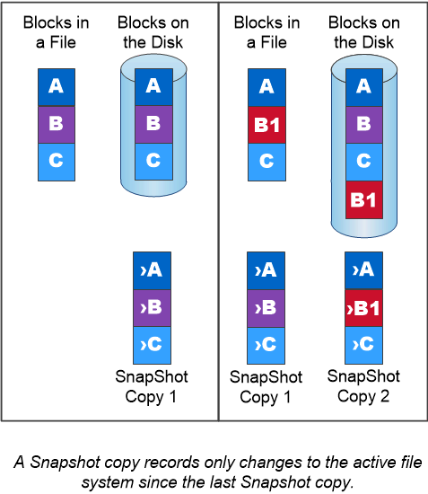

= Snapshot 복사본
:allow-uri-read: 
:icons: font
:imagesdir: ../media/

[role="lead"]
기존에는 ONTAP 복제 기술을 사용하여 DR(재해 복구) 및 데이터 아카이빙에 대한 요구사항을 해결했습니다. 클라우드 서비스가 등장하면서 ONTAP 복제는 NetApp Data Fabric의 엔드포인트 간 데이터 전송에 맞게 조정되었습니다. 이러한 모든 사용을 위한 기반은 ONTAP 스냅샷 기술입니다.

스냅샷 복사본 _ 은(는) 볼륨의 읽기 전용 시점 이미지입니다. 마지막 스냅샷 복사본이 생성된 이후 파일에 대한 변경사항만 기록하므로 이미지는 최소한의 스토리지 공간을 소비하고 무시할 만한 성능 오버헤드를 발생시킵니다.

스냅샷 복사본은 ONTAP의 핵심 스토리지 가상화 기술인 WAFL(Write Anywhere File Layout)의 효율성을 높여줍니다. _ 데이터베이스와 마찬가지로 WAFL는 메타데이터를 사용하여 디스크의 실제 데이터 블록을 가리킵니다. 하지만 WAFL은 데이터베이스와 달리 기존 블록을 덮어쓰지 않습니다. 업데이트된 데이터를 새 블록에 쓰고 메타데이터를 변경합니다.

스냅샷 복사본은 스냅샷 복사본을 생성할 때 데이터 블록이 아니라 ONTAP에서 메타데이터를 참조하기 때문에 효율적입니다. 이렇게 하면 다른 시스템에서 복사할 블록을 찾는 데 발생하는 "탐색 시간"과 복사 자체를 만드는 비용이 모두 제거됩니다.

스냅샷 복사본을 사용하여 개별 파일 또는 LUN을 복구하거나 볼륨의 전체 콘텐츠를 복원할 수 있습니다. ONTAP은 스냅샷 복사본의 포인터 정보를 디스크의 데이터와 비교하여 다운타임 또는 상당한 성능 비용 없이 누락 또는 손상된 개체를 재구성합니다.

_ 스냅샷 정책 _ 은(는) 시스템에서 볼륨의 스냅샷 복사본을 생성하는 방법을 정의합니다. 이 정책에서는 스냅샷 복사본을 생성할 시기, 유지할 복사본 수, 복사본의 이름 지정 방법 및 복제 레이블 지정 방법을 지정합니다. 예를 들어, 시스템이 매일 오전 12시 10분에 스냅샷 복사본 하나를 생성하고, 가장 최근의 복사본 2개를 보존한 후 "일별"(타임스탬프 추가)로 이름을 지정하고, 복제를 위해 "일별"로 레이블을 지정할 수 있습니다.

