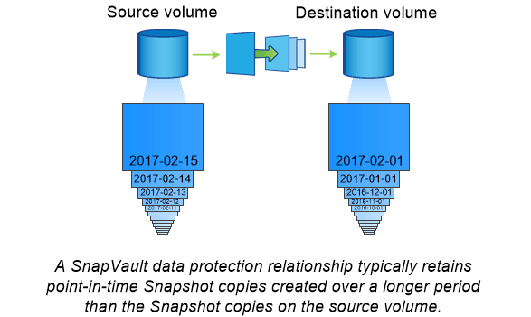

= SnapVault 아카이빙
:icons: font
:imagesdir: ../media/

[role="lead"]
SnapMirror 라이센스는 백업에 대한 SnapVault 관계와 재해 복구를 위한 SnapMirror 관계를 모두 지원하는 데 사용됩니다. SnapVault 라이센스는 더 이상 사용되지 않으며, 이제 볼트, 미러 및 미러-볼트 관계를 구성하는 데 SnapMirror 라이센스를 사용할 수 있습니다. SnapMirror 복제는 Snapshot 복사본의 ONTAP-to-ONTAP 복제에 사용되어 백업 및 재해 복구 사용 사례를 모두 지원합니다.

_SnapVault_는 표준 준수 및 기타 거버넌스 관련 목적을 위해 D2D Snapshot 복사본 복제를 위해 설계된 아카이브 기술입니다. 일반적으로 타겟에 현재 소스 볼륨에 있는 스냅샷 복사본만 포함된 SnapMirror 관계와는 대조적으로, SnapVault 타겟은 훨씬 더 오랜 기간 동안 생성된 시점 스냅샷 복사본을 유지합니다.

예를 들어, 정부의 회계 규정을 준수하기 위해 데이터의 월별 스냅샷 복사본을 20년 동안 유지하려 할 수 있습니다. 볼트 스토리지에서 데이터를 제공할 필요가 없으므로 대상 시스템에서 느리고 저렴한 디스크를 사용할 수 있습니다.

SnapMirror와 마찬가지로 SnapVault은 사용자가 처음으로 호출할 때 기본 전송을 수행합니다. 소스 볼륨의 스냅샷 복사본을 생성한 다음 복사본과 해당 복사본이 타겟 볼륨에 참조하는 데이터 블록을 전송합니다. SnapMirror와 달리 SnapVault은 이전 Snapshot 복사본을 기본 Snapshot에 포함하지 않습니다.

업데이트는 구성한 일정에 따라 비동기식입니다. 관계에 대한 정책에 정의된 규칙은 업데이트에 포함할 새 스냅샷 복사본과 유지할 복사본 수를 식별합니다. 정책에 정의된 레이블(예: "월간")은 소스의 스냅샷 정책에 정의된 하나 이상의 레이블과 일치해야 합니다. 그렇지 않으면 복제가 실패합니다.

[NOTE]
====
SnapMirror와 SnapVault는 동일한 명령 인프라를 공유합니다. 정책을 생성할 때 사용할 방법을 지정합니다. 두 방법 모두 피어링된 클러스터와 피어링된 SVM이 필요합니다.

====

