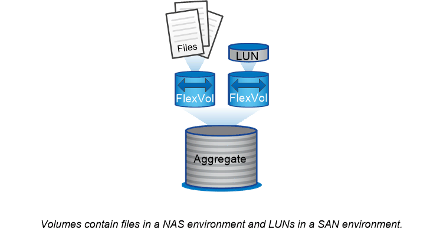

= 볼륨, Qtree, 파일 및 LUN
:icons: font
:imagesdir: ../media/

[role="lead"]
ONTAP는 _FlexVol 볼륨이라는 논리적 컨테이너의 클라이언트와 호스트에 데이터를 제공합니다. _ 이러한 볼륨은 포함된 집합체에만 느슨하게 결합되어 있기 때문에 기존 볼륨보다 데이터 관리 유연성이 뛰어납니다.

Aggregate에 여러 FlexVol 볼륨을 할당할 수 있으며 각 볼륨은 서로 다른 애플리케이션 또는 서비스 전용으로 할당됩니다. FlexVol 볼륨을 확장 및 축소하고, FlexVol 볼륨을 이동하고, FlexVol 볼륨의 효율적인 복사본을 생성할 수 있습니다. _qtree_를 사용하여 FlexVol 볼륨을 관리 가능한 단위로 파티셔닝하고 _quotas_를 사용하여 볼륨 리소스 사용을 제한할 수 있습니다.

볼륨에는 NAS 환경의 파일 시스템과 SAN 환경의 LUN이 포함됩니다. LUN(논리 단위 번호)은 SAN 프로토콜에 의해 지정된 _logical unit_이라는 디바이스의 식별자입니다.

LUN은 SAN 구성의 기본 스토리지 단위입니다. Windows 호스트는 스토리지 시스템의 LUN을 가상 디스크로 인식합니다. 필요에 따라 LUN을 다른 볼륨으로 중단 없이 이동할 수 있습니다.

데이터 볼륨 외에 다음과 같은 몇 가지 특별한 볼륨에 대해 알아야 합니다.

* a_node root volume_(일반적으로 ""vol0"")에는 노드 구성 정보와 로그가 포함됩니다.
* SVM 루트 볼륨 _ 은(는) SVM에서 제공하는 네임스페이스의 진입점 역할을 하며 네임스페이스 디렉토리 정보를 포함합니다.
* _System volumes_에는 서비스 감사 로그와 같은 특수 메타데이터가 포함되어 있습니다.

이러한 볼륨을 사용하여 데이터를 저장할 수 없습니다.

|===

 a| 
* _FlexGroup 볼륨_ *

일부 기업에서는 단일 네임스페이스를 페타바이트 단위의 스토리지로 사용해야 할 수 있으며, 이는 FlexVol 볼륨의 100TB 용량을 훨씬 초과합니다.

A_FlexGroup volume_은 200개의 구성 멤버 볼륨으로 최대 4천억 개의 파일을 지원하며, 이 볼륨을 서로 협력하여 모든 구성원에 걸쳐 로드 및 공간 할당을 균등하게 동적으로 조정합니다.

FlexGroup 볼륨에는 유지보수 또는 관리 오버헤드가 필요하지 않습니다. FlexGroup 볼륨을 생성하여 NAS 클라이언트와 공유하기만 하면 됩니다. ONTAP가 나머지 기능을 수행합니다.

|===