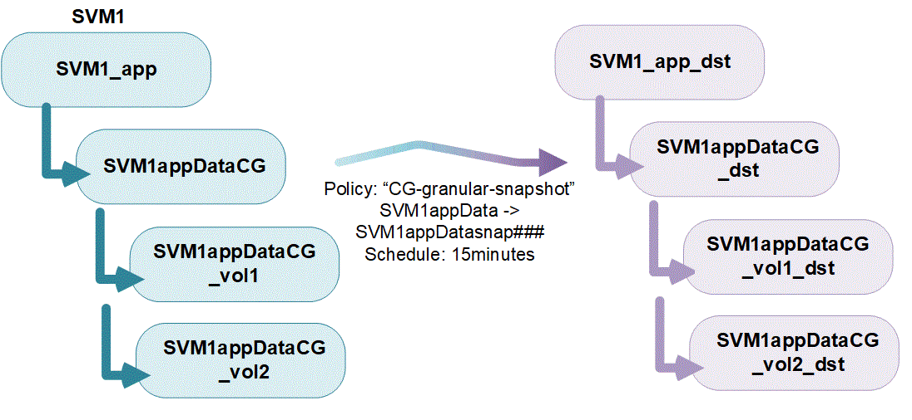
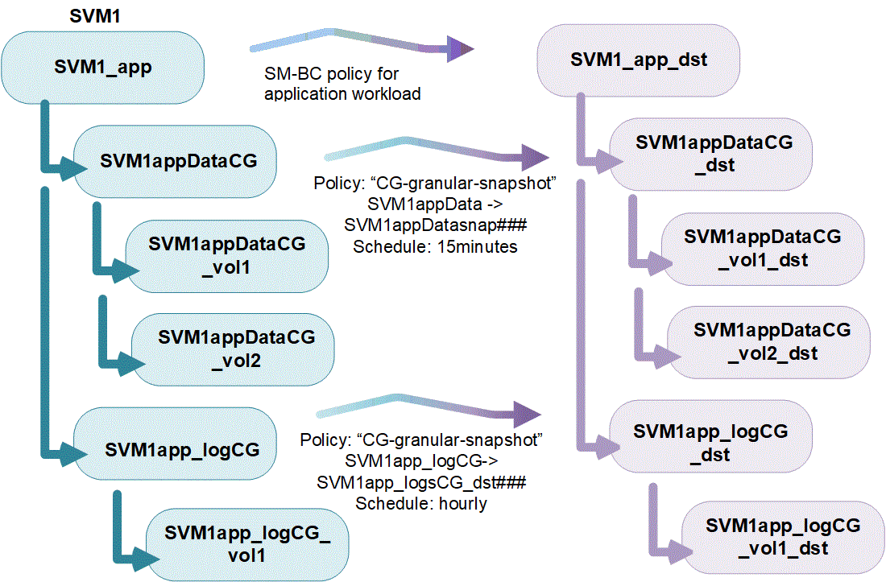

= 일관성 그룹 개요
:allow-uri-read: 
:icons: font
:imagesdir: ../media/

[role="lead"]
정합성 보장 그룹은 단일 유닛으로 관리되는 볼륨의 모음입니다. ONTAP에서 일관성 그룹을 사용하면 여러 볼륨에 걸쳐 있는 애플리케이션 워크로드를 손쉽게 관리하고 보호할 수 있습니다.

일관성 그룹을 사용하면 스토리지 관리를 간소화할 수 있습니다. 20개의 LUN을 아우르는 중요한 데이터베이스가 있다고 상상해 보십시오. LUN을 개별적으로 관리하거나 단일 정합성 보장 그룹으로 구성하여 LUN을 단일 데이터 세트로 처리할 수 있습니다.

정합성 보장 그룹은 애플리케이션 워크로드 관리를 용이하게 하여, 쉽게 구성된 로컬 및 원격 보호 정책과 동시에 장애 발생 시 정합성이 보장되거나 애플리케이션 정합성이 보장되는 Snapshot 복제본을 특정 시점에 볼륨 컬렉션에 제공합니다. 일관성 그룹의 스냅샷 복사본을 사용하여 전체 애플리케이션 워크로드를 복원할 수 있습니다.

== 일관성 그룹에 대해 알아봅니다

일관성 그룹은 프로토콜(NAS, SAN 또는 NVMe)에 관계없이 모든 FlexVol 볼륨을 지원하며, ONTAP REST API를 통해 또는 System Manager의 * 스토리지 > 일관성 그룹 * 메뉴 항목에서 관리할 수 있습니다. ONTAP 9.14.1부터는 ONTAP CLI를 사용하여 일관성 그룹을 관리할 수 있습니다.

정합성 보장 그룹은 개별 엔터티(볼륨 컬렉션) 또는 다른 정합성 보장 그룹으로 구성된 계층적 관계로 존재할 수 있습니다. 개별 볼륨은 볼륨의 세부 스냅샷 정책을 가질 수 있습니다. 또한 일관성 그룹 전체 스냅샷 정책이 있습니다. 일관성 그룹에는 전체 일관성 그룹을 복구하는 데 사용할 수 있는 SnapMirror 활성 동기화 관계 및 공유 SnapMirror 정책이 하나만 있을 수 있습니다.

다음 다이어그램에서는 개별 일관성 그룹을 사용하는 방법을 보여 줍니다. 에서 호스팅되는 애플리케이션의 데이터입니다 `SVM1` 두 볼륨 확장: `vol1` 및 `vol2`. 일관성 그룹의 스냅샷 정책은 15분마다 데이터의 스냅샷 복사본을 캡처합니다.

애플리케이션 워크로드가 클수록 여러 개의 일관성 그룹이 필요할 수 있습니다. 이 경우 단일 일관성 그룹이 부모 일관성 그룹의 하위 구성요소가 되는 계층적 일관성 그룹을 생성할 수 있습니다. 상위 일관성 그룹에는 최대 5개의 하위 일관성 그룹이 포함될 수 있습니다. 개별 정합성 보장 그룹과 마찬가지로 원격 SnapMirror 활성 동기화 보호 정책을 정합성 보장 그룹(상위 및 하위)의 전체 구성에 적용하여 애플리케이션 워크로드를 복구할 수 있습니다.

다음 예제에서는 응용 프로그램이 에 호스팅됩니다 `SVM1`. 관리자가 상위 일관성 그룹을 생성했습니다. `SVM1_app`다음과 같은 두 개의 하위 정합성 보장 그룹이 포함됩니다. `SVM1appDataCG` 을 참조하십시오 `SVM1app_logCG` 를 클릭합니다. 각 하위 정합성 보장 그룹에는 고유한 스냅샷 정책이 있습니다. 에 있는 볼륨의 스냅샷 복사본 `SVM1appDataCG` 15분마다 수행됩니다. 의 스냅샷 `SVM1app_logCG` 매시간 촬영됩니다. 부모 일관성 그룹 `SVM1_app` 에는 재해 발생 시 지속적인 서비스를 보장하기 위해 데이터를 복제하는 SnapMirror 활성 동기화 정책이 있습니다.

ONTAP 9.12.1부터 정합성 보장 그룹이 지원됩니다 xref:clone-task.html[클론 복제] 를 사용하여 정합성 보장 구성 구성원을 수정합니다 xref:modify-task.html[볼륨 추가 또는 제거] System Manager 및 ONTAP REST API 모두에서 ONTAP 9.12.1부터 ONTAP REST API는 다음을 지원합니다.

* 새 NFS 또는 SMB 볼륨 또는 NVMe 네임스페이스를 사용하여 일관성 그룹 생성
* 기존 일관성 그룹에 새 NFS 또는 SMB 볼륨 또는 NVMe 네임스페이스 추가

ONTAP REST API에 대한 자세한 내용은 를 참조하십시오 https://docs.netapp.com/us-en/ontap-automation/reference/api_reference.html#access-a-copy-of-the-ontap-rest-api-reference-documentation["ONTAP REST API 참조 설명서"].

== 정합성 보장 그룹 모니터링

ONTAP 9.13.1부터 정합성 보장 그룹은 실시간 및 내역 용량과 성능 모니터링을 제공하여 애플리케이션 및 개별 정합성 보장 그룹의 성능에 대한 통찰력을 제공합니다.

모니터링 데이터는 5분마다 업데이트되고 최대 1년 동안 유지됩니다. 다음에 대한 메트릭을 추적할 수 있습니다.

* 성능: IOPS, 지연 시간, 처리량
* 용량: 크기, 사용된 논리적 용량, 사용 가능한 용량

System Manager의 정합성 보장 그룹 메뉴에 있는 ** 개요** 탭에서 모니터링 데이터를 보거나 REST API에 요청하여 모니터링 데이터를 볼 수 있습니다. ONTAP 9.14.1부터는 를 사용하여 CLI에서 일관성 그룹 메트릭을 볼 수 있습니다 `consistency-group metrics show` 명령.

NOTE: ONTAP 9.13.1에서는 REST API를 사용하여 기간별 메트릭만 검색할 수 있습니다. ONTAP 9.14.1부터는 System Manager에서 기간별 메트릭을 사용할 수도 있습니다.

== 일관성 그룹 보호

정합성 보장 그룹은 다음을 통해 보호 기능을 제공합니다.

* 스냅샷 정책
* xref:../snapmirror-active-sync/index.html[SnapMirror 활성 동기화]
* <<mcc>> (ONTAP 9.11.1부터)
* xref:../data-protection/snapmirror-disaster-recovery-concept.html[SnapMirror 비동기] (ONTAP 9.13.1부터)
* link:../data-protection/snapmirror-svm-replication-concept.html["SVM 재해 복구"] (ONTAP 9.14.1부터)

일관성 그룹을 생성해도 보호가 자동으로 설정되지는 않습니다. 정합성 보장 그룹을 생성하거나 생성한 후에 로컬 및 원격 보호 정책을 설정할 수 있습니다.

일관성 그룹에 대한 보호를 구성하려면 를 참조하십시오 link:protect-task.html["일관성 그룹 보호"].

원격 보호를 활용하려면 에 대한 요구 사항을 충족해야 합니다 xref:../snapmirror-active-sync/prerequisites-reference.html[SnapMirror 활성 동기화].

NOTE: NAS 액세스를 위해 마운트된 볼륨에 SnapMirror 활성 동기화 관계를 설정할 수 없습니다.

== MetroCluster 구성의 일관성 그룹

ONTAP 9.11.1부터 MetroCluster 구성 내에서 클러스터의 새 볼륨에 정합성 보장 그룹을 프로비저닝할 수 있습니다. 이러한 볼륨은 미러링된 Aggregate에 프로비저닝됩니다.

볼륨이 프로비저닝되면 미러링된 Aggregate와 미러링되지 않은 애그리게이트 간에 일관성 그룹에 연결된 볼륨을 이동할 수 있습니다. 따라서 일관성 그룹에 연결된 볼륨은 미러링된 애그리게이트, 미러링되지 않은 애그리게이트 또는 둘 다에 위치할 수 있습니다. 일관성 그룹에 연결된 볼륨이 포함된 미러링된 애그리게이트를 수정하여 미러링되지 않은 상태로 만들 수 있습니다. 마찬가지로, 정합성 보장 그룹과 연결된 볼륨이 포함된 미러링되지 않은 애그리게이트를 수정하여 미러링을 활성화할 수 있습니다.

미러링된 애그리게이트에 배치된 일관성 그룹과 연결된 볼륨 및 스냅샷 복사본은 원격 사이트(사이트 B)에 복제됩니다. 사이트 B의 볼륨 콘텐츠는 정합성 보장 그룹에 대한 쓰기 순서 보증을 제공하므로 재해 발생 시 사이트 B에서 복구할 수 있습니다. ONTAP 9.11.1 이상을 실행 중인 클러스터에서 REST API 및 System Manager의 일관성 그룹을 사용하여 일관성 그룹 스냅샷 복사본에 액세스할 수 있습니다. ONTAP 9.14.1부터는 ONTAP CLI를 통해 스냅샷 복사본에 액세스할 수도 있습니다.

일관성 그룹에 연결된 볼륨 중 일부 또는 모두가 현재 액세스할 수 없는 미러링되지 않은 애그리게이트에 있는 경우, 일관성 그룹의 가져오기 또는 삭제 작업은 로컬 볼륨 또는 호스팅 애그리게이트가 오프라인 상태인 것처럼 동작합니다.

=== 복제에 대한 정합성 보장 그룹 구성

사이트 B에서 ONTAP 9.10.1 이하 버전을 실행하는 경우 미러링된 Aggregate에 있는 일관성 그룹과 연결된 볼륨만 사이트 B에 복제됩니다 정합성 보장 그룹 구성은 두 사이트가 모두 ONTAP 9.11.1 이상을 실행하는 경우 사이트 B에만 복제됩니다. 사이트 B를 ONTAP 9.11.1로 업그레이드한 후 사이트 A의 정합성 보장 그룹에 대한 모든 관련 볼륨이 미러링된 Aggregate에 배치된 데이터가 사이트 B에 복제됩니다

NOTE: 최적의 스토리지 성능과 가용성을 위해 미러링된 애그리게이트에 대해 최소 20%의 여유 공간을 유지하는 것이 좋습니다. 미러링되지 않은 애그리게이트의 권장사항은 10%이지만, 파일 시스템이 증분 변경을 흡수하기 위해 추가 10%의 공간을 사용할 수 있습니다. 증분식으로 변경하면 ONTAP의 COW Snapshot 기반 아키텍처로 인해 미러링된 애그리게이트의 공간 활용률이 증가합니다. 이러한 모범 사례를 준수하지 않을 경우 성능에 부정적인 영향을 미칠 수 있습니다.

== 업그레이드 고려 사항

ONTAP 9.10.1 이상으로 업그레이드할 때 SnapMirror 활성 동기화를 사용하여 생성한 일관성 그룹(이전의 SnapMirror Business Continuity)이 있습니다. ONTAP 9.8 및 9.9.1에서는 시스템 관리자의 * 스토리지 > 일관성 그룹 * 또는 ONTAP REST API에서 자동으로 업그레이드되어 관리할 수 있습니다. ONTAP 9.8 또는 9.9.1에서 업그레이드하는 방법에 대한 자세한 내용은 을 참조하십시오 link:../snapmirror-active-sync/upgrade-revert-task.html["SnapMirror 활성 동기화 업그레이드 및 되돌리기 고려 사항"].

REST API에서 생성된 일관성 그룹 스냅샷 복사본은 System Manager의 일관성 그룹 인터페이스 및 일관성 그룹 REST API 엔드포인트를 통해 관리할 수 있습니다. ONTAP 9.14.1부터는 ONTAP CLI를 사용하여 일관성 그룹 스냅샷을 관리할 수도 있습니다.

NOTE: ONTAPI 명령을 사용하여 생성된 스냅샷 복사본 `cg-start` 및 `cg-commit` 는 일관성 그룹 스냅샷으로 인식되므로 System Manager의 일관성 그룹 인터페이스 또는 ONTAP REST API의 일관성 그룹 엔드포인트를 통해 관리할 수 없습니다. ONTAP 9.14.1부터 SnapMirror 비동기식 정책을 사용하는 경우 이러한 스냅샷 복사본을 타겟 볼륨으로 미러링할 수 있습니다. 자세한 내용은 을 참조하십시오 xref:protect-task.html#configure-snapmirror-asynchronous[SnapMirror 비동기 구성].

== 릴리즈별 지원 기능

[cols="3,1,1,1,1,1,1"]
|===
|  | ONTAP 9.15.1 | ONTAP 9.14.1 | ONTAP 9.13.1 | ONTAP 9.12.1 | ONTAP 9.11.1 | ONTAP 9.10.1 

| 계층적 일관성 그룹 | ✓ | ✓ | ✓ | ✓ | ✓ | ✓ 

| 스냅샷 복사본으로 로컬 보호 | ✓ | ✓ | ✓ | ✓ | ✓ | ✓ 

| SnapMirror 활성 동기화 | ✓ | ✓ | ✓ | ✓ | ✓ | ✓ 

| MetroCluster 지원 | ✓ | ✓ | ✓ | ✓ | ✓ |  

| 2단계 커밋(REST API만 해당) | ✓ | ✓ | ✓ | ✓ | ✓ |  

| 응용 프로그램 및 구성 요소 태그 | ✓ | ✓ | ✓ | ✓ |  |  

| 클론 정합성 보장 그룹 | ✓ | ✓ | ✓ | ✓ |  |  

| 볼륨 추가 및 제거 | ✓ | ✓ | ✓ | ✓ |  |  

| 새 NAS 볼륨으로 CG를 생성합니다 | ✓ | ✓ | ✓ | REST API만 해당 |  |  

| 새로운 NVMe 네임스페이스를 사용하여 CG를 생성합니다 | ✓ | ✓ | ✓ | REST API만 해당 |  |  

| 하위 일관성 그룹 간에 볼륨을 이동합니다 | ✓ | ✓ | ✓ |  |  |  

| 정합성 보장 그룹 지오메트리를 수정합니다 | ✓ | ✓ | ✓ |  |  |  

| 모니터링 | ✓ | ✓ | ✓ |  |  |  

| SnapMirror 비동기식(단일 일관성 그룹만 해당) | ✓ | ✓ | ✓ |  |  |  

| SVM 재해 복구(단일 일관성 그룹만 해당) | ✓ | ✓ |  |  |  |  

| CLI 지원 | ✓ | ✓ |  |  |  |  
|===

== 일관성 그룹에 대해 자세히 알아보십시오

video::j0jfXDcdyzE[youtube,width=848,height=480]
.추가 정보
* link:https://docs.netapp.com/us-en/ontap-automation/["ONTAP 자동화 문서"^]
* xref:../snapmirror-active-sync/index.html[SnapMirror 활성 동기화]
* xref:../data-protection/snapmirror-disaster-recovery-concept.html[SnapMirror 비동기식 재해 복구 기본 사항]
* link:https://docs.netapp.com/us-en/ontap-metrocluster/["MetroCluster 설명서"]

