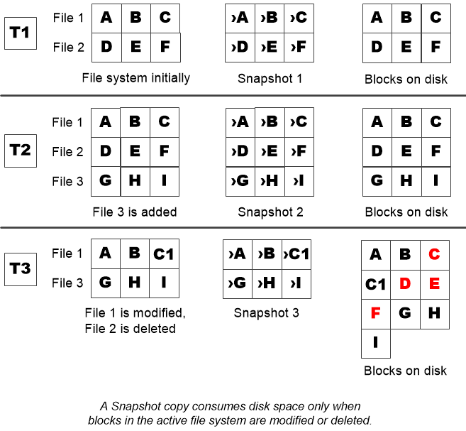

= 언제 스냅샷 복사본 예약 공간을 늘려야 합니다
:icons: font
:imagesdir: ../media/

[role="lead"]
스냅샷 예약 공간을 늘인지의 여부를 결정할 때는 스냅샷 복사본이 마지막 스냅샷 복사본 생성 이후 파일에 대한 변경 사항만 기록한다는 점을 기억해야 합니다. 활성 파일 시스템의 블록이 수정되거나 삭제될 때만 디스크 공간을 사용합니다.

이는 파일 시스템의 변경 속도가 스냅샷 복사본에서 사용하는 디스크 공간의 양을 결정하는 핵심 요소임을 의미합니다. 얼마나 많은 Snapshot 복사본을 생성하더라도 액티브 파일 시스템이 변경되지 않으면 디스크 공간이 사용되지 않습니다.

예를 들어, 데이터베이스 트랜잭션 로그가 포함된 FlexVol 볼륨의 경우 변경률이 더 높은 스냅샷 복사본 예약 공간이 20%까지 있을 수 있습니다. 더 많은 스냅샷 복사본을 생성하여 데이터베이스의 잦은 업데이트를 확보할 뿐만 아니라, Snapshot 복사본이 사용하는 추가 디스크 공간을 처리할 수 있도록 더 큰 스냅샷 복사본 예약 공간을 확보하려고 할 것입니다.

[TIP]
====
스냅샷 복사본은 블록 복사본이 아닌 블록에 대한 포인터로 구성됩니다. ONTAP는 스냅샷 복사본이 삭제될 때까지 블록을 "보류"(보류)하고 있는 블록에서의 포인터는 "클레임"이라고 생각할 수 있습니다.

====

