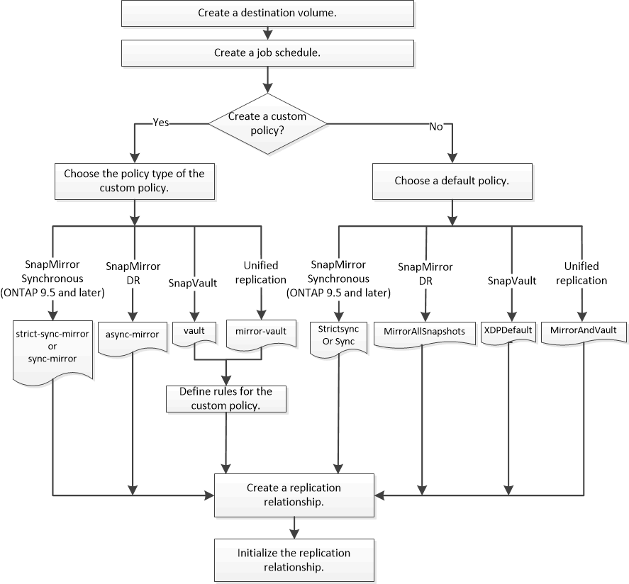

= SnapMirror 복제 워크플로우
:allow-uri-read: 
:icons: font
:imagesdir: ../media/

[role="lead"]
SnapMirror는 SnapMirror DR, 아카이브(이전의 SnapVault) 및 통합 복제라는 세 가지 유형의 데이터 보호 관계를 제공합니다. 동일한 기본 워크플로를 따라 각 관계 유형을 구성할 수 있습니다.

ONTAP 9.9.1의 일반 가용성에서 출발한 SnapMirror 비즈니스 연속성(SM-BC)은 제로 복구 시간 목표(제로 RTO) 또는 투명한 애플리케이션 페일오버(TAF)를 제공하여 SAN 환경에서 비즈니스 크리티컬 애플리케이션의 자동 페일오버를 지원합니다. SM-BC는 2개의 AFF 클러스터 또는 2개의 ASA(All-Flash SAN 어레이) 클러스터 구성으로 지원됩니다.

https://docs.netapp.com/us-en/ontap/smbc["NetApp 설명서: SnapMirror 비즈니스 연속성"]

SnapMirror 데이터 보호 관계의 각 유형에 대해 워크플로는 동일합니다. 대상 볼륨 생성, 작업 일정 생성, 정책 지정, 관계 생성 및 초기화

ONTAP 9.3부터는 '스냅샷 보호' 명령을 사용하여 한 번에 데이터 보호 관계를 구성할 수 있습니다. 스냅샷 보호 기능을 사용하더라도 워크플로우의 각 단계를 이해해야 합니다.

