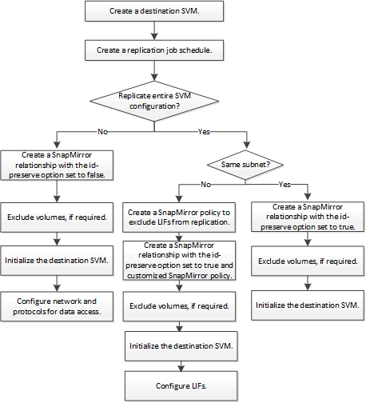

= SnapMirror SVM 복제 워크플로우
:allow-uri-read: 
:icons: font
:imagesdir: ../media/

[role="lead"]
SnapMirror SVM 복제에는 대상 SVM 생성, 복제 작업 일정 생성, SnapMirror 관계 생성 및 초기화가 포함됩니다.

[NOTE]
====
이 워크플로우에서는 이미 기본 정책 또는 사용자 지정 복제 정책을 사용하고 있다고 가정합니다.

====

