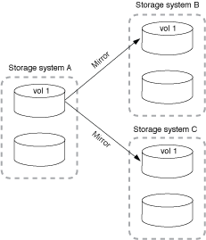
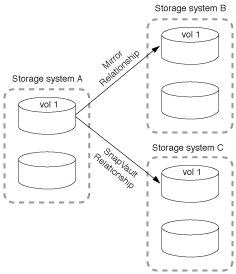
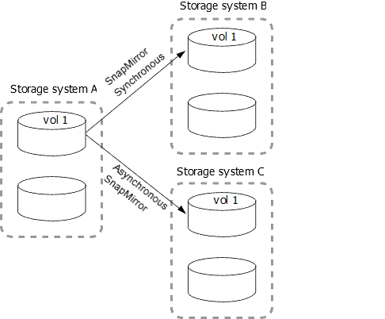
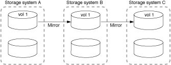
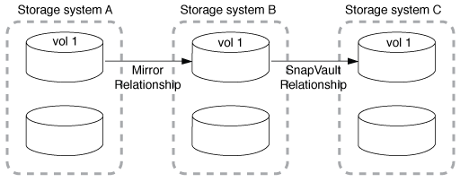

= 팬아웃 및 캐스케이드 데이터 보호 구축
:icons: font
:imagesdir: ../media/

[role="lead"]
fan-out_deployment 를 사용하여 데이터 보호를 여러 보조 시스템으로 확장할 수 있습니다. cascade_deployment를 사용하여 데이터 보호를 3차 시스템으로 확장할 수 있습니다.

팬아웃 및 계단식 배열 모두 SnapMirror DR, SnapVault 또는 통합 복제의 모든 조합을 지원합니다. 그러나 ONTAP 9.5부터 지원되는 SnapMirror Synchronous 관계는 하나 이상의 비동기 SnapMirror 관계가 있는 팬아웃 구축만 지원하고 다중 구간 배포를 지원하지 않습니다. 팬아웃 구성의 한 가지 관계만 SnapMirror Synchronous 관계일 수 있으며, 소스 볼륨의 다른 모든 관계는 비동기식 SnapMirror 관계여야 합니다.

[NOTE]
====
fan-in_deployment를 사용하여 여러 운영 시스템과 단일 보조 시스템 간에 데이터 보호 관계를 생성할 수 있습니다. 각 관계는 2차 시스템에서 다른 볼륨을 사용해야 합니다.

====
[NOTE]
====
팬아웃 또는 캐스케이드 구성의 일부인 볼륨은 재동기화에 시간이 오래 걸릴 수 있습니다. SnapMirror 관계가 오랫동안 "준비 중" 상태를 보고하는 것을 보면 흔히 볼 수 있습니다.

====

== 팬아웃(fan-out) 배포의 작동 방식

SnapMirror는 _multiple-mirror_and_mirror-vault_fan-out 배포를 지원합니다.

다중 미러 팬아웃 구축은 여러 보조 볼륨에 대한 미러 관계가 있는 소스 볼륨으로 구성됩니다.

미러 볼트(mirror-vault) 팬아웃 구축은 2차 볼륨에 대한 미러 관계와 다른 2차 볼륨에 대한 SnapVault 관계를 가진 소스 볼륨으로 구성됩니다.

ONTAP 9.5부터는 SnapMirror Synchronous 관계를 포함하는 팬아웃 구축을 수행할 수 있습니다. 그러나 팬아웃 구성의 한 관계만 SnapMirror Synchronous 관계일 수 있으며, 소스 볼륨의 다른 모든 관계는 비동기식 SnapMirror 관계여야 합니다.

== 다중 구간 배포의 작동 방식

SnapMirror는 _mirror-mirror_mirror-vault_,_vault-mirror_and_vault-vault_cascade 배포를 지원합니다.

미러 계단식 배열 구축은 소스 볼륨이 2차 볼륨으로 미러링되고 2차 볼륨이 3차 볼륨으로 미러링되는 관계 체인으로 구성됩니다. 2차 볼륨을 사용할 수 없게 되면 새로운 기준 전송을 수행하지 않고도 1차 볼륨과 3차 볼륨 간의 관계를 동기화할 수 있습니다.

ONTAP 9.6부터 미러 계단식 배열 배포에서 SnapMirror Synchronous 관계가 지원됩니다. 운영 볼륨과 2차 볼륨만 SnapMirror Synchronous 관계에 있을 수 있습니다. 2차 볼륨과 3차 볼륨 간의 관계는 비동기식이어야 합니다.

미러 소산 다중 구간 구축은 소스 볼륨이 보조 볼륨으로 미러링되고 2차 볼륨이 3차 볼륨으로 저장되는 관계 체인으로 구성됩니다.

볼트 미러 및 ONTAP 9.2부터 볼트-볼트 캐스케이드 배포도 지원됩니다.

* 볼트 미러 계단식 배열 구축은 소스 볼륨을 보조 볼륨으로 보관하고 2차 볼륨을 3차 볼륨으로 미러링하는 관계 체인으로 구성됩니다.
* (ONTAP 9.2부터) 볼트(Vault) 캐스케이드 배포는 소스 볼륨을 보조 볼륨으로 보관하고 2차 볼륨을 3차 볼륨으로 보관되는 일련의 관계로 구성됩니다.

.추가 참고 자료
* xref:../smbc/resume-protection-fan-out-configuration.html[SM-BC를 사용하여 팬아웃 구성에서 보호를 재개합니다]

