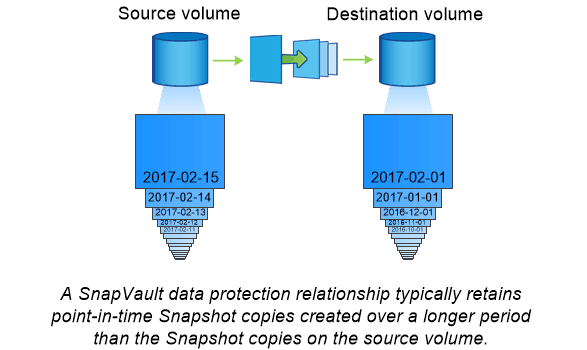

= SnapMirror 기술을 사용한 볼트 아카이브
:allow-uri-read: 
:icons: font
:imagesdir: ../media/

[role="lead"]
SnapMirror 볼트 정책은 ONTAP 9.3 이상에서 SnapVault 기술을 대체합니다. 표준 준수 및 기타 거버넌스 관련 목적으로 D2D 스냅샷 복사 복제에 SnapMirror 소산 정책을 사용합니다. 일반적으로 타겟에 현재 소스 볼륨에 있는 스냅샷 복사본만 포함되어 있는 SnapMirror 관계와는 대조적으로, 소산 대상에서는 훨씬 더 오랜 기간 동안 생성된 시점 Snapshot 복사본을 유지합니다.

예를 들어, 정부의 회계 규정을 준수하기 위해 데이터의 월별 스냅샷 복사본을 20년 동안 유지하려 할 수 있습니다. 볼트 스토리지에서 데이터를 제공할 필요가 없으므로 대상 시스템에서 느리고 저렴한 디스크를 사용할 수 있습니다.

아래 그림은 SnapMirror 볼트 데이터 보호 관계를 보여줍니다.

== 볼트 데이터 보호 관계가 초기화되는 방법

관계에 대한 SnapMirror 정책에서는 기본 내용과 모든 업데이트를 정의합니다.

기본 볼트 정책 'XDPDefault'에 따른 기본 전송은 소스 볼륨의 스냅샷 복사본을 만든 다음 해당 복사본과 대상 볼륨에 참조하는 데이터 블록을 전송합니다. SnapMirror 관계와는 달리, 볼트 백업에는 기준선에 이전 Snapshot 복사본이 포함되지 않습니다.

== 볼트 데이터 보호 관계를 업데이트하는 방법

업데이트는 구성한 일정에 따라 비동기식입니다. 관계에 대한 정책에 정의된 규칙은 업데이트에 포함할 새 스냅샷 복사본과 유지할 복사본 수를 식별합니다. 정책에 정의된 레이블(예: "월간")은 소스의 스냅샷 정책에 정의된 하나 이상의 레이블과 일치해야 합니다. 그렇지 않으면 복제가 실패합니다.

SnapMirror는 'XDPDefault' 정책의 각 업데이트에 정책 규칙에 정의된 레이블과 일치하는 레이블이 있는 경우 마지막 업데이트 이후에 만들어진 스냅샷 복사본을 전송합니다. XDPDefault 정책에 대한 'napmirror policy show' 명령의 출력은 다음과 같습니다.

* SnapMirror가 관계를 업데이트할 때 XDPDefault가 스냅샷 복사본을 생성하지 않는다는 것을 나타내는 "스냅샷 생성"은 "거짓"입니다.
* XDPDefault에는 "매일", "매주" 규칙이 있어 SnapMirror가 관계를 업데이트하면 소스의 일치하는 레이블이 있는 모든 스냅샷 복사본이 전송됩니다.

[listing]
----
cluster_dst::> snapmirror policy show -policy XDPDefault -instance

                     Vserver: vs0
      SnapMirror Policy Name: XDPDefault
      SnapMirror Policy Type: vault
                Policy Owner: cluster-admin
                 Tries Limit: 8
           Transfer Priority: normal
   Ignore accesstime Enabled: false
     Transfer Restartability: always
 Network Compression Enabled: false
             Create Snapshot: false
                     Comment: Default policy for XDP relationships with daily and weekly
                              rules.
       Total Number of Rules: 2
                  Total Keep: 59
                       Rules: SnapMirror Label     Keep  Preserve Warn Schedule Prefix
                              ----------------     ----  -------- ---- -------- ------
                              daily                   7  false       0 -        -
                              weekly                 52  false       0 -        -
----