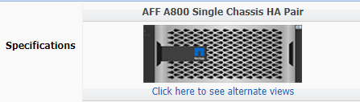

= 노드 또는 쉘프에 드라이브 추가
:allow-uri-read: 
:icons: font

[role="lead"]
드라이브를 노드나 쉘프에 추가하여 핫 스페어 수를 늘리거나 로컬 계층(애그리게이트)에 공간을 추가할 수 있습니다.

.시작하기 전에
추가하려는 드라이브가 플랫폼에서 지원되어야 합니다. 를 사용하여 확인할 수 있습니다 link:https://hwu.netapp.com/["NetApp Hardware Universe를 참조하십시오"^].

단일 절차에서 추가해야 하는 최소 드라이브 수는 6개입니다. 단일 드라이브를 추가하면 성능이 저하될 수 있습니다.

.NetApp Hardware Universe를 위한 단계
. 제품** 드롭다운 메뉴에서 하드웨어 구성을 선택합니다
. 플랫폼을 선택합니다.
. 실행 중인 ONTAP 버전을 선택한 다음 ** 결과 표시**.
. 그래픽 아래에서 **대체 보기를 보려면 여기를 클릭하십시오**를 선택합니다. 구성과 일치하는 보기를 선택합니다.

.드라이브 설치 단계
. 를 확인하십시오 link:https://mysupport.netapp.com/site/["NetApp Support 사이트"^] 최신 드라이브 및 셸프 펌웨어 및 디스크 검증 패키지 파일의 경우
+
노드나 쉘프에 최신 버전이 없는 경우 새 드라이브를 설치하기 전에 해당 버전을 업데이트하십시오.

+
현재 펌웨어 버전이 없는 새 드라이브에서 드라이브 펌웨어가 중단 없이 자동으로 업데이트됩니다.

. 적절하게 접지합니다.
. 플랫폼 전면에서 베젤을 조심스럽게 분리합니다.
. 새 드라이브에 맞는 슬롯을 확인합니다.
+

NOTE: 드라이브를 추가할 수 있는 올바른 슬롯은 플랫폼 모델과 ONTAP 버전에 따라 다릅니다. 경우에 따라 특정 슬롯에 순서대로 드라이브를 추가해야 할 수도 있습니다. 예를 들어, AFF A800에서는 특정 간격으로 드라이브를 추가하여 빈 슬롯 클러스터를 남겨 둡니다. 반면, AFF A220에서는 외부에서 쉘프 중앙으로 실행되는 다음 빈 슬롯에 새 드라이브를 추가합니다.

+
의 구성에 맞는 올바른 슬롯을 식별하려면 시작하기 전 **의 단계를 참조하십시오 link:https://hwu.netapp.com/["NetApp Hardware Universe를 참조하십시오"^].

. 새 드라이브를 삽입합니다.
+
.. 캠 핸들이 열린 위치에 있는 상태에서 두 손을 사용하여 새 드라이브를 삽입합니다.
.. 드라이브가 멈출 때까지 누릅니다.
.. 드라이브가 중간 평면에 완전히 장착되고 핸들이 제자리에 고정되도록 캠 핸들을 닫습니다. 캠 핸들이 드라이브 면과 올바르게 정렬되도록 캠 핸들을 천천히 닫아야 합니다.

. 드라이브의 작동 LED(녹색)가 켜져 있는지 확인합니다.
+
드라이브의 작동 LED가 고정되어 있으면 드라이브에 전원이 공급되고 있는 것입니다. 드라이브 작동 LED가 깜박이면 드라이브에 전원이 공급되고 I/O가 진행 중임을 의미합니다. 드라이브 펌웨어가 자동으로 업데이트되면 LED가 깜박입니다.

. 다른 드라이브를 추가하려면 4-6단계를 반복합니다.
+
새 드라이브는 노드에 할당될 때까지 인식되지 않습니다. 새 드라이브를 수동으로 할당하거나, 노드가 드라이브 자동 할당 규칙을 따르는 경우 ONTAP에서 새 드라이브를 자동으로 할당할 때까지 기다릴 수 있습니다.

. 새 드라이브를 모두 인식한 후 드라이브가 추가되었고 소유권이 올바르게 지정되었는지 확인합니다.

.설치 확인 단계
. 디스크 목록을 표시합니다.
+
'스토리지 집계 show-spare-disks'

+
올바른 노드가 소유하는 새 드라이브가 표시됩니다.

. **옵션(ONTAP 9.3 및 이전 버전에만 해당), **새로 추가된 드라이브를 0으로 설정:
+
'스토리지 디스크 제로'

+
이전에 ONTAP 로컬 계층(애그리게이트)에서 사용된 드라이브는 다른 애그리게이트에 추가하기 전에 0으로 초기화해야 합니다. ONTAP 9.3 및 이전 버전에서는 제로화가 완료되는 데 몇 시간이 걸릴 수 있으며, 이는 노드의 비제로화 드라이브 크기에 따라 달라집니다. 이제 드라이브를 제로화하면 로컬 계층의 크기를 빠르게 늘려야 하는 경우 지연이 발생하지 않습니다. 이 문제는 ONTAP 9.4 이상에서 _fast zeroing_을 사용하여 드라이브를 제로화하는 데 몇 초밖에 걸리지 않습니다.

.결과
새 드라이브가 준비되었습니다. 로컬 계층(애그리게이트)에 추가하거나, 핫 스페어 목록에 배치하거나, 새 로컬 계층을 생성할 때 추가할 수 있습니다.
