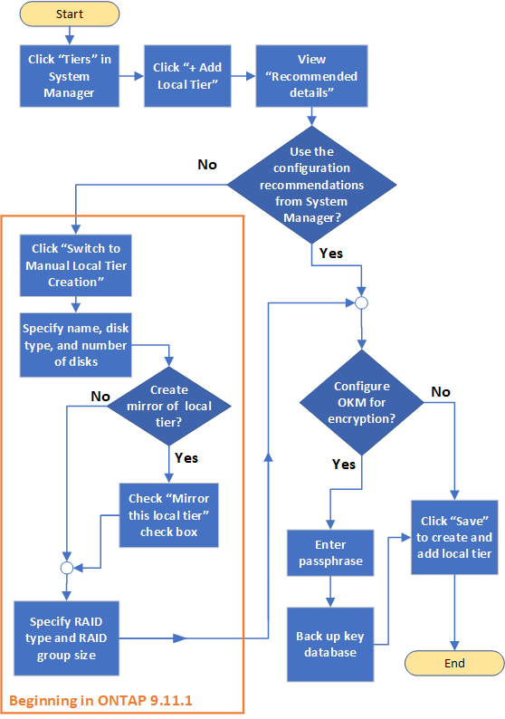

= 로컬 계층 추가 워크플로우(애그리게이트)
:allow-uri-read: 
:icons: font
:imagesdir: ../media/

[role="lead"]
로컬 계층(애그리게이트)을 생성하면 시스템의 볼륨에 스토리지를 제공할 수 있습니다.

로컬 계층(애그리게이트)을 생성하는 워크플로우는 사용하는 인터페이스에 따라 다름 -- System Manager 또는 CLI:

[role="tabbed-block"]
====
.System Manager 워크플로우
--
* System Manager를 사용하여 로컬 계층을 추가(생성)합니다 *

System Manager에서는 로컬 계층 구성에 대한 권장 모범 사례를 기반으로 로컬 계층을 생성합니다.

ONTAP 9.11.1부터 로컬 계층을 추가하기 위해 자동 프로세스 중에 권장된 것과 다른 구성을 원하는 경우 로컬 계층을 수동으로 구성할 수 있습니다.

--
.CLI 워크플로우
--
* CLI를 사용하여 애그리게이트 * 를 추가(생성)합니다

ONTAP 9.2부터 ONTAP은 Aggregate(자동 프로비저닝)를 생성할 때 권장되는 구성을 제공할 수 있습니다. 모범 사례를 기반으로 하는 권장 구성이 현재 환경에 적합한 경우, 수락하여 애그리게이트를 생성할 수 있습니다. 그렇지 않으면 수동으로 애그리게이트를 생성할 수 있습니다.

image:aggregate-creation-workflow.gif["집계 생성 워크플로"]

--
====