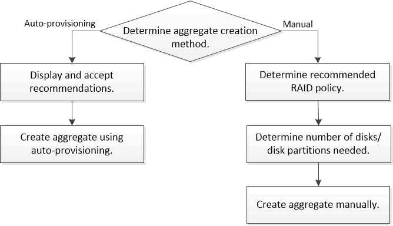

= 집계 생성 워크플로
:icons: font
:imagesdir: ../media/

[role="lead"]
Aggregate를 생성하면 시스템의 볼륨에 스토리지가 제공됩니다. ONTAP 9.2부터는 ONTAP에서 시스템에 대한 애그리게이트 구성을 추천합니다(자동 프로비저닝). 사용자 환경에서 자동 프로비저닝 방법을 사용할 수 없거나 적절한 경우 애그리게이트를 수동으로 구성할 수 있습니다.

