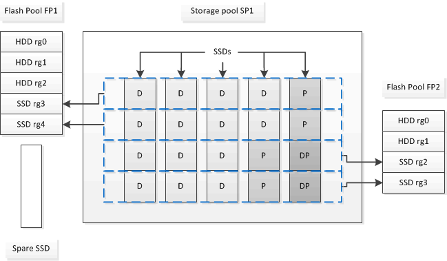

= Flash Pool SSD 파티셔닝이 스토리지 풀을 사용하는 Flash Pool 애그리게이트에 작동하는 방식
:allow-uri-read: 
:icons: font
:imagesdir: ../media/

[role="lead"]
2개 이상의 Flash Pool 애그리게이트에서 캐시를 제공하는 경우 Flash Pool SSD(Solid State Drive) 파티셔닝을 사용해야 합니다. Flash Pool SSD 파티셔닝은 Flash Pool을 사용하여 모든 애그리게이트에서 SSD를 공유할 수 있습니다. 이를 통해 여러 Aggregate에 패리티 비용을 분산하고, SSD 캐시 할당 유연성을 높이고, SSD 성능을 극대화할 수 있습니다.

Flash Pool 애그리게이트에서 SSD를 사용하려면 SSD를 스토리지 풀에 배치해야 합니다. 스토리지 풀에서 루트 데이터 파티셔닝으로 분할된 SSD는 사용할 수 없습니다. SSD를 스토리지 풀에 배치한 후에는 SSD를 더 이상 독립 실행형 디스크로 관리할 수 없으며, Flash Pool과 연결된 애그리게이트를 제거하고 스토리지 풀을 제거하지 않는 한 스토리지 풀에서 제거할 수 없습니다.

SSD 스토리지 풀은 4개의 동일한 할당 유닛으로 나뉩니다. 스토리지 풀에 추가된 SSD는 4개의 파티션으로 분할되며 4개의 할당 유닛 각각에 하나의 파티션이 할당됩니다. 스토리지 풀의 SSD는 동일한 HA 쌍이 소유해야 합니다. 기본적으로 HA 2노드의 각 노드에 2개의 할당 유닛이 할당됩니다. 할당 유닛은 제공하는 애그리게이트를 소유하는 노드에서 소유해야 합니다. 노드 중 하나의 애그리게이트에 더 많은 플래시 캐시가 필요한 경우 기본 할당 유닛 수를 이동하여 하나의 노드에서 수를 줄이고 파트너 노드의 수를 늘릴 수 있습니다.

스토리지 풀에는 하나의 예비 SSD만 사용할 수 있습니다. 스토리지 풀에서 HA 쌍의 두 노드가 소유한 Flash Pool 애그리게이트에 할당 유닛을 제공하는 경우, 두 노드 중 하나의 스페어 SSD를 소유할 수 있습니다. 하지만 스토리지 풀에서 HA 쌍 중 하나의 노드가 소유한 Flash Pool 애그리게이트에만 할당 유닛을 제공하는 경우 해당 SSD 스페어가 동일한 노드에서 소유해야 합니다.

다음 그림은 Flash Pool SSD 파티셔닝의 예입니다. SSD 스토리지 풀은 두 개의 Flash Pool 애그리게이트에서 캐시를 제공합니다.

스토리지 풀 SP1은 5개의 SSD와 핫 스페어 SSD로 구성됩니다. 스토리지 풀의 할당 유닛 중 2개가 Flash Pool FP1에 할당되고 2개는 Flash Pool FP2에 할당됩니다. FP1에는 RAID4의 캐시 RAID 유형이 있습니다. 따라서 FP1에 제공된 할당 유닛에는 패리티로 지정된 파티션이 하나만 있습니다. FP2에는 RAID-DP의 캐시 RAID 유형이 있습니다. 따라서 FP2에 제공된 할당 유닛에는 패리티 파티션과 이중 패리티 파티션이 포함됩니다.

이 예에서는 각 Flash Pool 애그리게이트에 2개의 할당 유닛이 할당된다. 그러나 Flash Pool 애그리게이트 중 하나에 더 큰 캐시가 필요할 경우 해당 Flash Pool 애그리게이트에 3개의 할당 유닛을 할당할 수 있으며, 그중 1개는 다른 하나에 할당할 수 있습니다.
