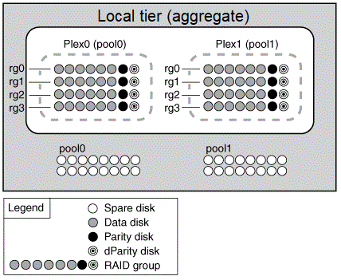
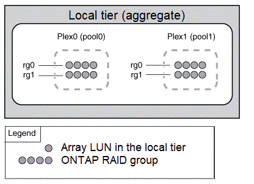

= 미러링된 데이터의 작동 방식
:allow-uri-read: 
:icons: font
:imagesdir: ../media/

[role="lead"]
미러링된 애그리게이트에는 2_plex_(데이터 복사본)가 있습니다. 이 플렉스는 SyncMirror 기능을 사용하여 데이터를 복제하여 이중화를 제공합니다.

미러링된 Aggregate가 생성될 때(또는 두 번째 플렉스를 기존 aggregate에 추가할 때) ONTAP는 원래 plex(plex0)의 데이터를 새 plex(plex1)에 복사합니다. 플렉스는 물리적으로 분리되어(각 플렉스는 자체 RAID 그룹과 자체 풀을 가지고 있음) 플렉스가 동시에 업데이트됩니다. 이 기능은 장애가 발생한 디스크가 골재 RAID 레벨보다 더 많은 경우 데이터 손실을 방지해 주며, 장애가 발생한 원인을 해결하는 동안 영향을 받지 않는 플렉스가 계속해서 데이터를 제공하기 때문에 연결이 끊어지거나 연결이 끊어지는 문제를 방지합니다. 문제가 발생한 플렉스가 해결된 후 두 플렉스가 미러 관계를 재동기화하여 다시 설정합니다.

시스템의 디스크 및 어레이 LUN은 pool0 및 pool1의 두 개의 풀로 구분됩니다. Plex0은 pool0에서 스토리지를 가져오고 plex1은 pool1에서 스토리지를 가져옵니다.

다음 다이어그램에서는 SyncMirror 기능이 설정 및 구현된 디스크로 구성된 애그리게이트를 보여 줍니다. Aggregate plex1에 대해 두 번째 플렉스를 생성했습니다. Plex1의 데이터는 Plex0에 있는 데이터의 복제본이며 RAID 그룹도 동일합니다. 32개의 스페어 디스크가 풀풀 0 또는 풀 1, 16개의 디스크에 각 풀에 할당됩니다.

다음 다이어그램은 SyncMirror 기능이 설정 및 구현된 스토리지 LUN으로 구성된 애그리게이트를 보여 줍니다. Aggregate plex1에 대해 두 번째 플렉스를 생성했습니다. Plex1은 Plex0의 사본이며 RAID 그룹도 동일합니다.

