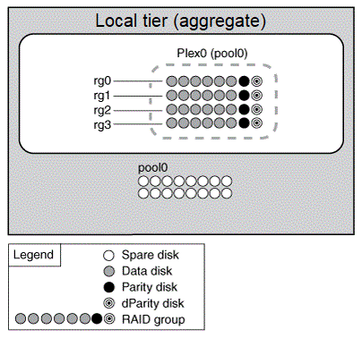
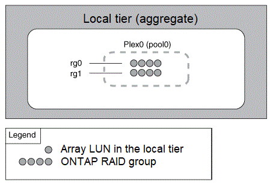
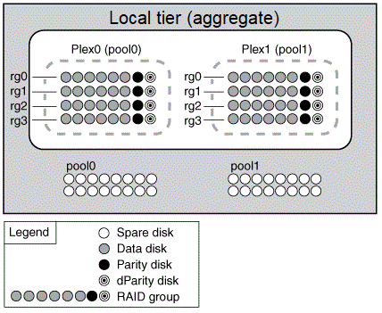
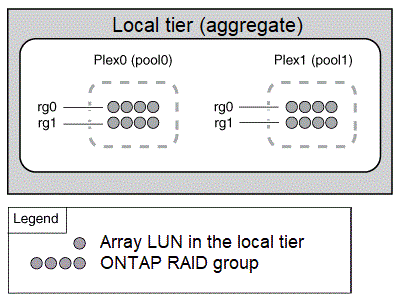

= 미러링되지 않은 로컬 계층(애그리게이트)
:allow-uri-read: 
:icons: font
:imagesdir: ../media/

[role="lead"]
ONTAP에는 _SyncMirror_라는 선택적 기능이 있습니다. 이 기능을 사용하면 서로 다른 RAID 그룹에 저장된 복사본 또는 _Plex_의 로컬 계층 데이터를 동기식으로 미러링할 수 있습니다. 플렉스는 RAID 유형보다 더 많은 디스크에 장애가 발생하거나 RAID 그룹 디스크에 대한 연결이 끊어지면 데이터 손실을 방지합니다.

System Manager를 사용하거나 CLI를 사용하여 로컬 계층을 생성할 때 로컬 계층이 미러링되거나 미러링되지 않은 계층을 지정할 수 있습니다.

== 미러링되지 않은 로컬 계층(애그리게이트)의 작동 방식

로컬 계층이 미러링되도록 지정하지 않으면 해당 계층이 미러링되지 않은 로컬 계층(애그리게이트)으로 생성됩니다. 미러링되지 않은 로컬 계층에는 해당 로컬 계층에 속한 모든 RAID 그룹이 포함된 1_plex_(데이터 복사본)만 있습니다.

다음 다이어그램은 하나의 플렉스를 사용하여 디스크로 구성된 미러링되지 않은 로컬 계층을 보여 줍니다. 로컬 계층에는 rg0, rg1, RG2 및 rg3의 4개의 RAID 그룹이 있습니다. 각 RAID 그룹에는 6개의 데이터 디스크, 1개의 패리티 디스크 및 1개의 dparity(이중 패리티) 디스크가 있습니다. 로컬 계층에서 사용하는 모든 디스크는 동일한 풀 ""pool0""에서 가져옵니다.

다음 다이어그램에서는 스토리지 LUN이 있는 미러링되지 않은 로컬 계층과 단일 플렉스를 보여 줍니다. 이 그룹에는 rg0과 rg1이라는 두 개의 RAID 그룹이 있습니다. 로컬 계층에서 사용하는 모든 스토리지 LUN은 동일한 풀 ""pool0""에서 가져옵니다.

== 미러링된 로컬 계층(애그리게이트)의 작동 방식

미러링된 애그리게이트에는 2_plex_(데이터 복사본)가 있습니다. 이 플렉스는 SyncMirror 기능을 사용하여 데이터를 복제하여 이중화를 제공합니다.

로컬 계층을 생성할 때 해당 계층이 미러링된 로컬 계층임을 지정할 수 있습니다. 또한 기존 미러링되지 않은 로컬 계층에 두 번째 플렉스를 추가하여 미러링된 계층으로 만들 수도 있습니다. SyncMirror 기능을 사용하여 ONTAP는 원본 플렉스(플렉스 0)의 데이터를 새 플렉스(플렉스 1)로 복사합니다. 플렉스는 물리적으로 분리되어(각 플렉스는 자체 RAID 그룹과 자체 풀을 가지고 있음) 플렉스가 동시에 업데이트됩니다.

이 구성은 장애가 발생한 원인을 해결하는 동안 영향을 받지 않는 플렉스가 계속해서 데이터를 제공하기 때문에 애그리게이트의 RAID 레벨보다 더 많은 디스크에 장애가 발생할 경우 데이터 손실을 방지하고 접속이 끊어질 경우 데이터 손실을 방지합니다. 문제가 발생한 플렉스가 해결된 후 두 플렉스가 미러 관계를 재동기화하여 다시 설정합니다.

시스템의 디스크와 스토리지 LUN은 "pool0"과 "pool1"의 두 개의 풀로 구분됩니다. Plex0은 pool0에서 스토리지를 가져오고 plex1은 pool1에서 스토리지를 가져옵니다.

다음 다이어그램은 SyncMirror 기능이 활성화 및 구현된 디스크로 구성된 로컬 계층을 보여 줍니다. 로컬 계층인 "plex1"에 대해 두 번째 플렉스를 만들었습니다. Plex1의 데이터는 Plex0에 있는 데이터의 복제본이며 RAID 그룹도 동일합니다. 32개의 스페어 디스크는 풀당 16개의 디스크를 사용하여 pool0 또는 pool1에 할당됩니다.

다음 다이어그램은 SyncMirror 기능이 설정 및 구현된 스토리지 LUN으로 구성된 로컬 계층을 보여 줍니다. 로컬 계층인 "plex1"에 대해 두 번째 플렉스를 만들었습니다. Plex1은 Plex0의 사본이며 RAID 그룹도 동일합니다.

NOTE: 최적의 스토리지 성능과 가용성을 위해 미러링된 애그리게이트에 대해 최소 20%의 여유 공간을 유지하는 것이 좋습니다. 미러링되지 않은 애그리게이트의 권장사항은 10%이지만, 파일 시스템이 증분 변경을 흡수하기 위해 추가 10%의 공간을 사용할 수 있습니다. 증분식으로 변경하면 ONTAP의 COW Snapshot 기반 아키텍처로 인해 미러링된 애그리게이트의 공간 활용률이 증가합니다. 이러한 모범 사례를 준수하지 않을 경우 성능에 부정적인 영향을 미칠 수 있습니다.
