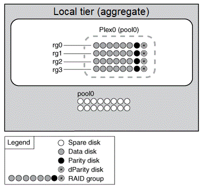

= 미러링되지 않은 애그리게이트가 작동하는 방식
:allow-uri-read: 
:icons: font
:imagesdir: ../media/

[role="lead"]
SyncMirror를 사용하지 않는 한 모든 애그리게이트는 미러링되지 않은 것입니다. 미러링되지 않은 애그리게이트에는 해당 애그리게이트에 속한 모든 RAID 그룹이 포함된 하나의_plex_(데이터 복사본)만 있습니다.

다음 다이어그램에서는 단일 플렉스를 사용하여 디스크로 구성된 미러링되지 않은 애그리게이트를 보여 줍니다. 애그리게이트에는 rg0, rg1, rg2, rg3의 4개의 RAID 그룹이 있습니다. 각 RAID 그룹에는 6개의 데이터 디스크, 1개의 패리티 디스크 및 1개의 dparity(이중 패리티) 디스크가 있습니다. Aggregate에서 사용하는 모든 디스크는 동일한 풀 pool0에서 가져옵니다.

다음 다이어그램에서는 스토리지 LUN이 있는 미러링되지 않은 Aggregate와 해당 단일 플렉스를 보여 줍니다. 이 그룹에는 rg0과 rg1이라는 두 개의 RAID 그룹이 있습니다. Aggregate에서 사용하는 모든 스토리지 LUN은 동일한 풀 pool0에서 가져옵니다.

image::../media/unmirrored-aggregate-with-array-luns.gif[위의 텍스트로 다이어그램이 디자인 되었습니다.]
