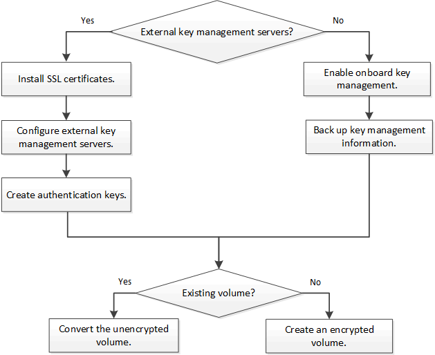

= NetApp 볼륨 암호화 워크플로우
:allow-uri-read: 
:icons: font
:imagesdir: ../media/

[role="lead"]
볼륨 암호화를 활성화하려면 키 관리 서비스를 구성해야 합니다. 새 볼륨이나 기존 볼륨에서 암호화를 활성화할 수 있습니다.

NVE를 사용하여 데이터를 암호화하려면 VE 라이센스를 설치하고 키 관리 서비스를 구성해야 합니다. 라이센스를 설치하기 전에 다음을 수행해야 합니다 link:luster-version-support-nve-task.html["ONTAP 버전이 NVE를 지원하는지 확인합니다"].
