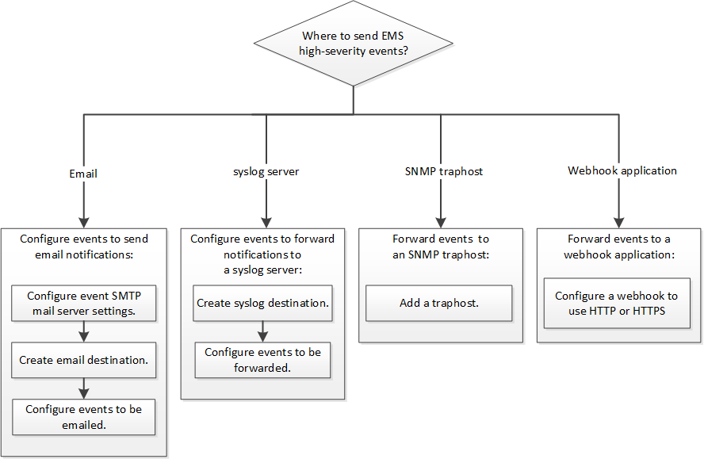

= EMS 구성 작업 흐름
:allow-uri-read: 
:icons: font
:imagesdir: ../media/

[role="lead"]
중요한 EMS 이벤트 알림을 e-메일로 보내거나, syslog 서버로 전달하거나, SNMP traphost로 전달하거나, webhook 애플리케이션으로 전달되도록 구성해야 합니다. 이를 통해 적시에 수정 조치를 취함으로써 시스템 중단을 방지할 수 있습니다.

환경에 서버 및 애플리케이션과 같은 다른 시스템에서 기록된 이벤트를 집계하기 위한 syslog 서버가 이미 포함되어 있는 경우, 해당 syslog 서버를 사용하여 스토리지 시스템의 중요한 이벤트 알림도 쉽게 확인할 수 있습니다.

환경에 syslog 서버가 아직 포함되어 있지 않은 경우 중요한 이벤트 알림에 e-메일을 사용하는 것이 더 쉽습니다.

이벤트 알림을 SNMP traaphost에 이미 전달하는 경우 해당 traaphost에서 중요한 이벤트를 모니터링할 수 있습니다.

.선택
* 이벤트 알림을 보내도록 EMS를 설정합니다.
+
|===

| 원하는 작업 | 참조 항목... 

 a| 
EMS는 중요한 이벤트 알림을 이메일 주소로 전송합니다
 a| 
xref:configure-ems-events-send-email-task.adoc[e-메일 알림을 보내도록 중요한 EMS 이벤트를 구성합니다]

 a| 
중요한 이벤트 알림을 syslog 서버로 전달하는 EMS입니다
 a| 
xref:configure-ems-events-notifications-syslog-task.adoc[syslog 서버로 알림을 전달하도록 중요한 EMS 이벤트를 구성합니다]

 a| 
EMS에서 이벤트 알림을 SNMP traaphost로 전달하도록 하려는 경우
 a| 
xref:configure-snmp-traphosts-event-notifications-task.adoc[이벤트 알림을 수신하도록 SNMP traaphosts를 구성합니다]

 a| 
EMS에서 이벤트 알림을 Webhook 애플리케이션으로 전달하려는 경우
 a| 
xref:configure-webhooks-event-notifications-task.adoc[Webhook 애플리케이션에 알림을 전달하도록 중요한 EMS 이벤트를 구성합니다]

|===

