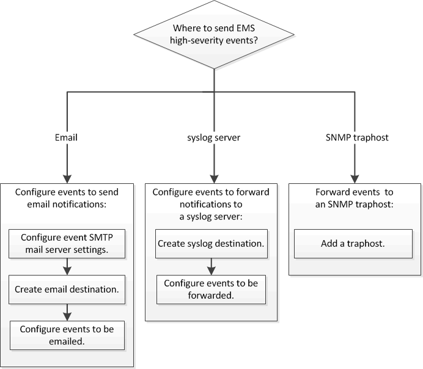

= EMS 구성 작업 흐름
:icons: font
:imagesdir: ../media/

[role="lead"]
중요한 EMS 이벤트 알림을 e-메일로 보내거나, syslog 서버로 전달하거나, SNMP traphost로 전달하거나, REST API 서버로 전송하도록 구성해야 합니다. 이를 통해 적시에 수정 조치를 취함으로써 시스템 중단을 방지할 수 있습니다.

