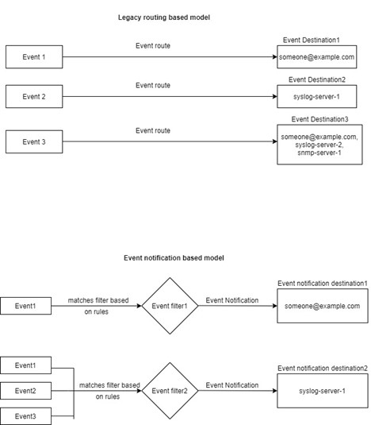

= EMS 이벤트 매핑 모델
:allow-uri-read: 
:icons: font
:imagesdir: ../media/

[role="lead"]
ONTAP 9.0 이전에는 EMS 이벤트가 이벤트 이름 패턴 일치를 기준으로 이벤트 대상에만 매핑될 수 있었습니다. 이 모델을 사용하는 ONTAP 명령 집합('이벤트 대상', '이벤트 경로')은 최신 버전의 ONTAP에서 계속 사용할 수 있지만 ONTAP 9.0부터는 더 이상 사용되지 않습니다.

ONTAP 9.0부터 ONTAP EMS 이벤트 대상 매핑의 모범 사례는 이벤트 필터, 이벤트 알림, 이벤트 알림 대상 명령 집합을 사용하여 여러 필드에서 패턴 일치를 수행하는 보다 확장 가능한 이벤트 필터 모델을 사용하는 것입니다.

더 이상 사용되지 않는 명령어를 이용하여 EMS mapping을 설정한 경우, 'event filter', 'event notification', 'event notification destination' 명령어 세트를 사용하도록 mapping을 업데이트해야 한다.

이벤트 대상에는 두 가지 유형이 있습니다.

. * 시스템 생성 대상 *: 기본적으로 5개의 시스템 생성 이벤트 대상이 있습니다.
+
** '대들레부들'
** "ASUP"
** '비판들
** 페이저
** 트라프호스트
+
시스템 생성 대상 중 일부는 특별한 목적으로 사용됩니다. 예를 들어, ASUP 대상은 callhome. * 이벤트를 ONTAP의 AutoSupport 모듈로 라우팅하여 AutoSupport 메시지를 생성합니다.

. * 사용자 작성 대상 *: '이벤트 목적지 작성' 명령을 사용하여 수동으로 생성됩니다.
+
[listing]
----
cluster-1::event*> destination show
                                                                 Hide
Name             Mail Dest.        SNMP Dest.         Syslog Dest.       Params
---------------- ----------------- ------------------ ------------------ ------
allevents        -                 -                  -                  false
asup             -                 -                  -                  false
criticals        -                 -                  -                  false
pager            -                 -                  -                  false
traphost         -                 -                  -                  false
5 entries were displayed.
+
cluster-1::event*> destination create -name test -mail test@xyz.com
This command is deprecated. Use the "event filter", "event notification destination" and "event notification" commands, instead.
+
cluster-1::event*> destination show
+                                                                     Hide
Name             Mail Dest.        SNMP Dest.         Syslog Dest.       Params
---------------- ----------------- ------------------ ------------------ ------
allevents        -                 -                  -                  false
asup             -                 -                  -                  false
criticals        -                 -                  -                  false
pager            -                 -                  -                  false
test             test@xyz.com      -                  -                  false
traphost         -                 -                  -                  false
6 entries were displayed.
----

사용되지 않는 모델에서는 이벤트 라우트 add-destinations 명령을 사용하여 EMS 이벤트가 대상에 개별적으로 매핑됩니다.

[listing]
----
cluster-1::event*> route add-destinations -message-name raid.aggr.* -destinations test
This command is deprecated. Use the "event filter", "event notification destination" and "event notification" commands, instead.
4 entries were acted on.

cluster-1::event*> route show -message-name raid.aggr.*
                                                               Freq    Time
Message                          Severity       Destinations   Threshd Threshd
-------------------------------- -------------- -------------- ------- -------
raid.aggr.autoGrow.abort         NOTICE         test           0       0
raid.aggr.autoGrow.success       NOTICE         test           0       0
raid.aggr.lock.conflict          INFORMATIONAL  test           0       0
raid.aggr.log.CP.count           DEBUG          test           0       0
4 entries were displayed.
----
보다 확장성이 뛰어난 새로운 EMS 이벤트 알림 메커니즘은 이벤트 필터 및 이벤트 알림 대상을 기반으로 합니다. 새 이벤트 알림 메커니즘에 대한 자세한 내용은 다음 KB 문서를 참조하십시오.

* link:https://kb.netapp.com/Advice_and_Troubleshooting/Data_Storage_Software/ONTAP_OS/FAQ%3A_Overview_of_Event_Management_System_for_ONTAP_9["ONTAP 9용 이벤트 관리 시스템 개요"^]

