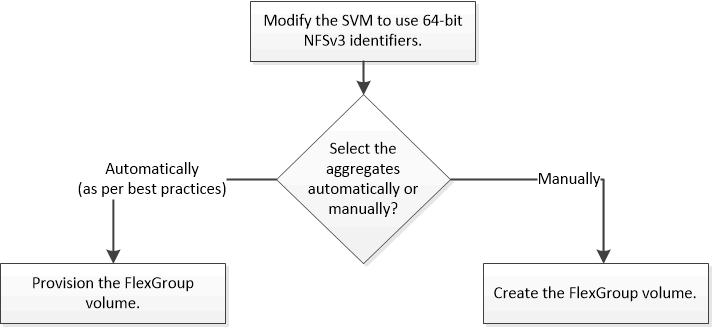

= FlexGroup 볼륨 설정 워크플로우
:allow-uri-read: 
:icons: font
:imagesdir: ../media/

[role="lead"]
최적의 성능을 위한 모범 사례에 따라 ONTAP가 애그리게이트를 자동으로 선택하는 FlexGroup 볼륨을 프로비저닝하거나, 데이터 액세스를 위해 애그리게이트를 수동으로 선택하고 구성하여 FlexGroup 볼륨을 생성할 수 있습니다.

SVM에 대해 허용되는 프로토콜 목록에 NFS 및 SMB를 추가하여 SVM을 생성해야 합니다.

4개 미만의 노드가 있는 클러스터에서만 FlexGroup 볼륨을 자동으로 프로비저닝할 수 있습니다. 노드가 4개 이상인 클러스터에서는 FlexGroup 볼륨을 수동으로 생성해야 합니다.
