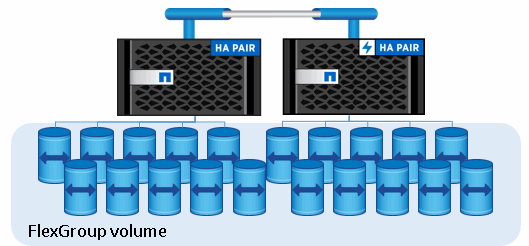

= FlexGroup 볼륨이란
:allow-uri-read: 
:icons: font
:imagesdir: ../media/

[role="lead"]
FlexGroup 볼륨은 자동 로드 분산 및 확장성과 함께 고성능을 제공하는 스케일아웃 NAS 컨테이너입니다. FlexGroup 볼륨에는 트래픽을 자동으로 투명하게 공유하는 여러 구성요소가 포함되어 있습니다.

FlexGroup 볼륨은 다음과 같은 이점을 제공합니다.

* 높은 확장성
+
ONTAP 9.1 이상에서 FlexGroup 볼륨의 최대 크기는 20PB이며 10노드 클러스터에서 4천억 개의 파일이 있습니다.

* 고성능
+
FlexGroup 볼륨은 클러스터의 리소스를 활용하여 높은 처리량과 짧은 지연 시간을 가진 워크로드를 지원할 수 있습니다.

* 관리 기능의 단순화
+
FlexGroup 볼륨은 FlexVol 볼륨과 비슷한 방식으로 관리할 수 있는 단일 네임스페이스 컨테이너입니다.

