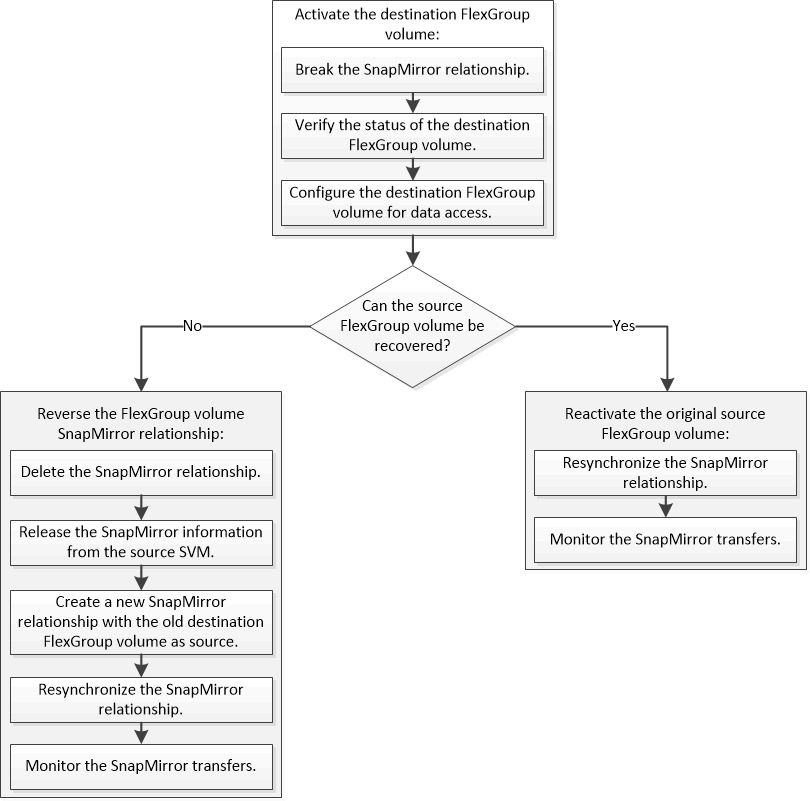

= FlexGroup 볼륨에 대한 재해 복구 워크플로우
:icons: font
:imagesdir: ../media/

[role="lead"]
소스 FlexGroup 볼륨에서 재해가 발생하면 대상 FlexGroup 볼륨을 활성화하고 클라이언트 액세스를 리디렉션해야 합니다. 소스 FlexGroup 볼륨을 복구할 수 있는지 여부에 따라 소스 FlexGroup 볼륨을 다시 활성화하거나 SnapMirror 관계를 반대로 해야 합니다.

SnapMirror 중단 및 재동기화와 같은 일부 SnapMirror 작업이 실행 중인 경우 대상 FlexGroup 볼륨에 대한 클라이언트 액세스가 잠시 차단됩니다. SnapMirror 작업이 실패하면 일부 구성요소가 이 상태로 남아 FlexGroup 볼륨에 대한 액세스가 거부될 수 있습니다. 이 경우 SnapMirror 작업을 다시 시도해야 합니다.
