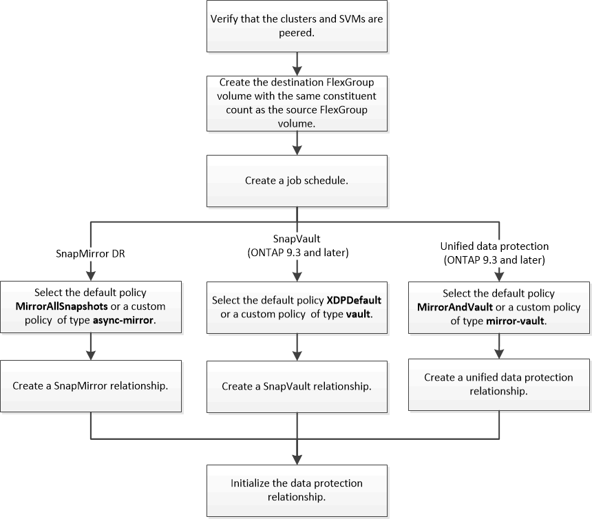

= FlexGroup 볼륨에 대한 데이터 보호 워크플로우
:allow-uri-read: 
:icons: font
:imagesdir: ../media/

[role="lead"]
FlexGroup 볼륨에 대한 SnapMirror DR(재해 복구) 관계를 생성할 수 있습니다. ONTAP 9.3부터는 SnapVault 기술을 사용하여 FlexGroup 볼륨을 백업 및 복원할 수 있으며, 동일한 대상을 백업 및 DR에 사용하는 통합 데이터 보호 관계를 만들 수 있습니다.

데이터 보호 워크플로우는 클러스터 및 SVM 피어 관계 확인, 타겟 볼륨 생성, 작업 일정 생성, 정책 지정, 데이터 보호 관계 생성 및 관계 초기화로 구성됩니다.

.이 작업에 대해
FlexGroup 볼륨에 대한 SnapMirror 관계 유형은 항상 XDP입니다. SnapMirror 관계에서 제공하는 데이터 보호 유형은 사용하는 복제 정책에 따라 결정됩니다. 생성할 복제 관계에 필요한 유형의 기본 정책이나 사용자 지정 정책을 사용할 수 있습니다. 다음 표에서는 기본 정책 유형과 다양한 유형의 데이터 보호 관계에 대해 지원되는 사용자 지정 정책 유형을 보여 줍니다.

|===

| 관계 유형 | 기본 정책 | 사용자 지정 정책 유형입니다 

 a| 
SnapMirror DR
 a| 
MirrorAllSnapshots을 선택합니다
 a| 
비동기식 - 미러

 a| 
SnapVault 백업
 a| 
XDPDefault
 a| 
볼트

 a| 
통합 데이터 보호
 a| 
MirrorAndVault를 선택합니다
 a| 
대칭 복사 - 볼트

|===
FlexGroup 볼륨에서는 MirrorLatest 정책이 지원되지 않습니다.
