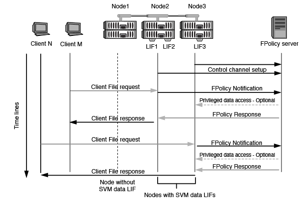

= 노드-외부 FPolicy 서버 통신 프로세스는 무엇입니까
:allow-uri-read: 
:icons: font
:imagesdir: ../media/

[role="lead"]
FPolicy 구성을 올바르게 계획하려면 노드-외부 FPolicy 서버 통신 프로세스가 무엇인지 이해해야 합니다.

각 스토리지 가상 머신(SVM)에 참여하는 모든 노드는 TCP/IP를 사용하여 외부 FPolicy 서버(FPolicy 서버)에 연결을 시작합니다. FPolicy 서버에 대한 연결은 노드 데이터 LIF를 사용하여 설정됩니다. 따라서 노드에 SVM을 위한 운영 데이터 LIF가 있는 경우에만 참여 노드가 연결을 설정할 수 있습니다.

참여 노드의 각 FPolicy 프로세스는 정책이 사용되도록 설정된 경우 FPolicy 서버에 연결을 설정하려고 시도합니다. 정책 구성에 지정된 FPolicy 외부 엔진의 IP 주소와 포트를 사용합니다.

이 연결을 통해 데이터 LIF를 통해 각 SVM에 참여하는 각 노드에서 FPolicy 서버로 제어 채널을 설정합니다. 또한 IPv4 및 IPv6 데이터 LIF 주소가 동일한 참여 노드에 있는 경우 FPolicy는 IPv4와 IPv6 모두에 대한 연결을 시도합니다. 따라서 SVM이 여러 노드로 확장되거나 IPv4 및 IPv6 주소가 둘 다 있는 경우 SVM에서 FPolicy 정책을 활성화한 후 FPolicy 서버에서 클러스터의 여러 제어 채널 설정 요청을 준비할 수 있어야 합니다.

예를 들어, 클러스터에 Node1, Node2, Node3와 같은 3개의 노드가 있고, SVM 데이터 LIF가 Node2와 Node3에만 분산되는 경우, 데이터 볼륨의 분산에 관계없이 제어 채널은 Node2와 Node3에서만 시작됩니다. Node2에는 SVM에 속하는 두 개의 데이터 LIF(LIF1 및 LIF2)가 있으며, 초기 접속은 LIF1입니다. LIF1에 장애가 발생하면 FPolicy는 LIF2에서 제어 채널을 설정하려고 시도합니다.

== FPolicy가 LIF 마이그레이션 또는 페일오버 중에 외부 통신을 관리하는 방법입니다

데이터 LIF는 동일한 노드의 데이터 포트 또는 원격 노드의 데이터 포트로 마이그레이션할 수 있습니다.

데이터 LIF가 페일오버되거나 마이그레이션되면 FPolicy 서버에 새 제어 채널 연결이 만들어집니다. 그런 다음 FPolicy는 시간이 초과된 SMB 및 NFS 클라이언트 요청을 다시 시도할 수 있습니다. 그 결과 새 알림이 외부 FPolicy 서버로 전송됩니다. 이 노드는 FPolicy 서버 응답을 원래의 제한 시간이 초과된 SMB 및 NFS 요청에 대해 거부합니다.

== 노드 페일오버 중에 FPolicy가 외부 통신을 관리하는 방법

FPolicy 통신에 사용되는 데이터 포트를 호스팅하는 클러스터 노드에 장애가 발생하면 ONTAP는 FPolicy 서버와 노드 간의 연결을 끊습니다.

FPolicy 통신에 사용되는 데이터 포트를 다른 활성 노드로 마이그레이션하도록 페일오버 정책을 구성하여 FPolicy 서버로 클러스터 페일오버가 미치는 영향을 완화할 수 있습니다. 마이그레이션이 완료되면 새 데이터 포트를 사용하여 새 연결이 설정됩니다.

LIF 관리자가 데이터 포트를 마이그레이션하도록 구성되지 않은 경우 FPolicy 서버가 장애가 발생한 노드가 나타날 때까지 기다려야 합니다. 노드가 가동되면 새 세션 ID가 있는 해당 노드에서 새 연결이 시작됩니다.

[NOTE]
====
FPolicy 서버에서 Keep-alive 프로토콜 메시지의 끊어진 연결을 감지합니다. FPolicy를 구성할 때 세션 ID를 제거하는 시간이 초과되었습니다. 기본 연결 유지 시간 초과는 2분입니다.

====