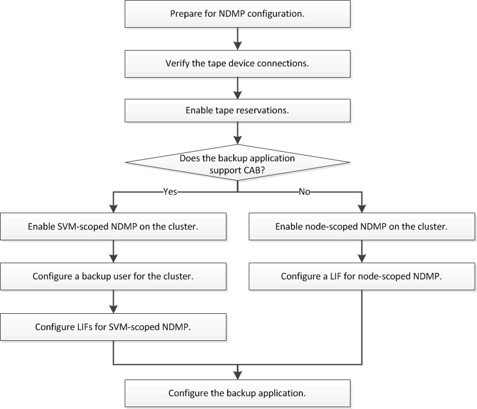

= NDMP 구성 워크플로우
:icons: font
:imagesdir: ../media/

[role="lead"]
NDMP를 통해 테이프 백업을 설정하려면 NDMP 구성 준비, 테이프 디바이스 연결 확인, 테이프 예약 활성화, SVM 또는 노드 레벨에서 NDMP 구성, 클러스터에서 NDMP 설정, 백업 사용자 구성, LIF 구성 및 백업 애플리케이션 구성이 필요합니다.

