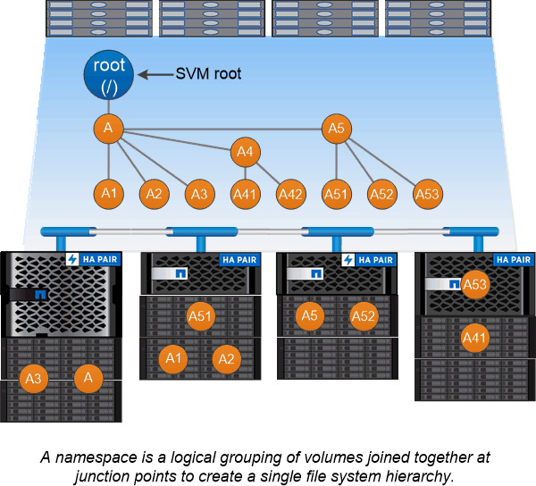

= 네임스페이스 및 교차점 개요
:allow-uri-read: 
:icons: font
:imagesdir: ../media/

[role="lead"]
nas_namespace_는 단일 파일 시스템 계층을 생성하기 위해 _junction points_에 함께 결합된 볼륨의 논리적 그룹입니다. 권한이 충분한 클라이언트는 저장소에 있는 파일의 위치를 지정하지 않고 네임스페이스의 파일에 액세스할 수 있습니다. Junced 볼륨은 클러스터의 모든 위치에 상주할 수 있습니다.

관심 파일이 포함된 모든 볼륨을 마운트하는 대신 NAS 클라이언트는 nfs_export_를 마운트하거나 smb_share에 액세스합니다. _ 내보내기 또는 공유는 전체 네임스페이스 또는 네임스페이스 내의 중간 위치를 나타냅니다. 클라이언트는 해당 액세스 지점 아래에 마운트된 볼륨만 액세스합니다.

필요에 따라 네임스페이스에 볼륨을 추가할 수 있습니다. 상위 볼륨 접합 바로 아래 또는 볼륨 내의 디렉토리에 접합 지점을 생성할 수 있습니다. "vol3"이라는 이름의 볼륨에 대한 볼륨 접합부의 경로는 "/vol1/vol2/vol3" 또는 "/vol1/dir2/vol3" 또는 "/dir1/dir2/vol3"일 수 있습니다. 이 경로를 _junction path ._라고 합니다

모든 SVM에는 고유한 네임스페이스가 있습니다. SVM 루트 볼륨은 네임스페이스 계층 구조의 진입점입니다.

[NOTE]
====
노드 운영 중단 또는 페일오버 발생 시에도 데이터가 계속 사용 가능하도록 하려면 SVM 루트 볼륨에 대해 _load-sharing mirror_copy를 생성해야 합니다.

====

.예
다음 예에서는 junction path "/eng/home"이 있는 SVM VS1 상에 ""home4""라는 이름의 볼륨을 생성합니다.

[listing]
----
cluster1::> volume create -vserver vs1 -volume home4 -aggregate aggr1 -size 1g -junction-path /eng/home
[Job 1642] Job succeeded: Successful
----