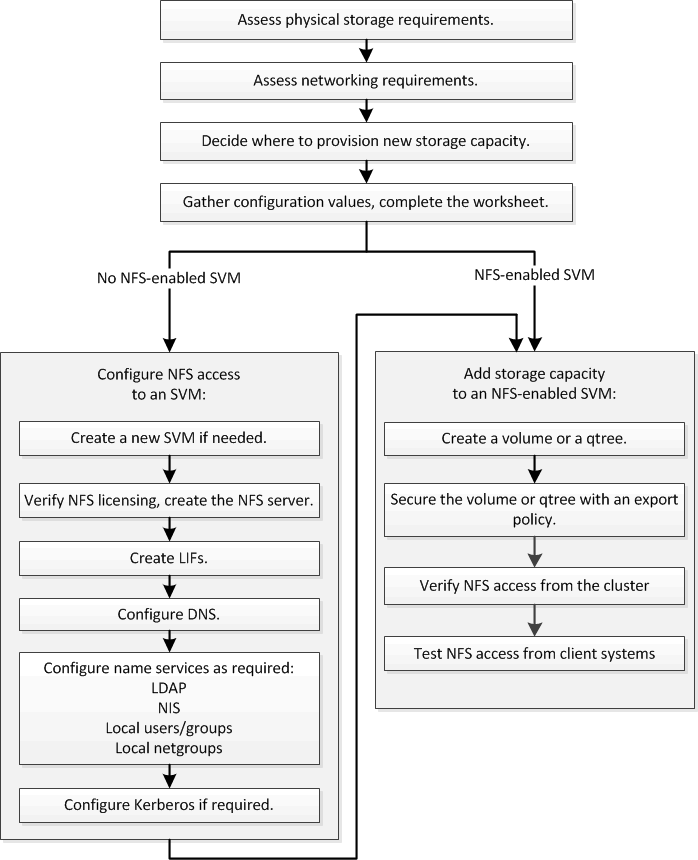

= NFS 구성 워크플로우
:allow-uri-read: 
:icons: font
:imagesdir: ../media/

[role="lead"]
NFS를 구성하려면 물리적 스토리지 및 네트워킹 요구사항을 평가한 다음, 목표에 맞는 워크플로우를 선택해야 합니다. 새로운 SVM 또는 기존 SVM에 대한 NFS 액세스를 구성하거나, NFS 액세스를 위해 이미 완벽하게 구성된 기존 SVM에 볼륨 또는 qtree를 추가하십시오.

