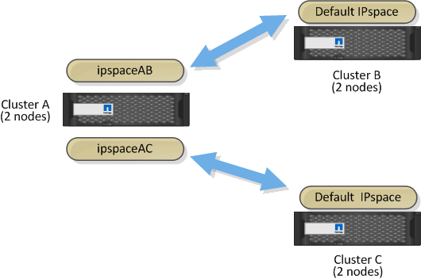

= 맞춤형 IPspace를 사용하여 복제 트래픽을 격리하십시오
:allow-uri-read: 
:icons: font
:imagesdir: ../media/

[role="lead"]
맞춤형 IPspace를 사용하여 클러스터에서 다른 동료들과 상호 작용을 분리할 수 있습니다. _Designated 인터클러스터 연결 _ 이라고 하는 이 구성을 통해 서비스 공급자는 멀티 테넌트 환경에서 복제 트래픽을 격리할 수 있습니다.

예를 들어 클러스터 A와 클러스터 B 사이의 복제 트래픽을 클러스터 A와 클러스터 C 사이의 복제 트래픽과 분리하려고 한다고 가정합니다 이렇게 하려면 클러스터 A에서 2개의 IPspace를 생성할 수 있습니다

IPspace에는 클러스터 B와 통신하는 데 사용하는 인터클러스터 LIF가 포함되어 있습니다 다른 에는 다음 그림과 같이 클러스터 C와 통신하는 데 사용하는 인터클러스터 LIF가 포함되어 있습니다.

사용자 지정 IPspace 구성에 대한 자세한 내용은 _네트워크 관리 가이드_를 참조하십시오.
