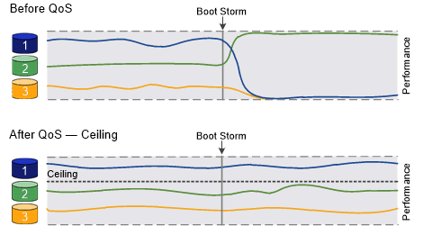
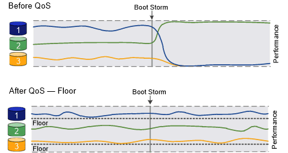

= QoS 개요를 통해 처리량 보장
:allow-uri-read: 
:icons: font
:imagesdir: ../media/

[role="lead"]
스토리지 QoS(서비스 품질)를 사용하여 주요 워크로드의 성능이 다른 워크로드에 의해 저하되지 않도록 보장할 수 있습니다. 경쟁 워크로드에 대한 throughput_ceiling_을 설정하여 시스템 리소스에 미치는 영향을 제한하거나 중요한 워크로드에 대한 throughput_floor_를 설정하여 경쟁 워크로드의 요구에 관계없이 최소 처리량 목표를 달성할 수 있습니다. 동일한 워크로드에 대해 천장과 바닥을 설정할 수도 있습니다.

== 처리량 천장 정보(QoS Max)

처리량 상한은 워크로드의 처리량을 최대 IOPS 또는 MBps, 즉 IOPS 및 MBps로 제한합니다. 아래 그림에서는 워크로드 2의 처리량 상한을 통해 워크로드 1과 3이 "괴롭지" 않도록 합니다.

policy group_은 하나 이상의 워크로드에 대한 처리량 한도를 정의합니다. 워크로드는 _ 스토리지 객체에 대한 입출력 작업을 나타냅니다. _ 볼륨, 파일, qtree 또는 LUN 또는 SVM의 모든 볼륨, 파일, Qtree 또는 LUN입니다. 정책 그룹을 생성할 때 상한을 지정하거나 워크로드를 모니터링하여 지정할 때까지 기다릴 수 있습니다.

NOTE: 워크로드에 대한 처리량이 지정된 상한을 최대 10% 초과할 수 있습니다. 특히, 작업 부하에 대한 처리량이 급격하게 변경될 경우 더욱 그렇습니다. 천장은 버스트를 처리하기 위해 최대 50%까지 초과될 수 있습니다. 토큰이 최대 150%까지 누적되면 단일 노드에서 버스트가 발생합니다

== 처리량 기준(QoS Min)

처리량 한도 에서는 워크로드의 처리량이 최소 IOPS 또는 MBps, 즉 IOPS 및 MBps 미만으로 떨어지지 않도록 보장합니다. 아래 그림에서 워크로드 1과 워크로드 3의 처리량 플로어는 워크로드 2의 수요에 관계없이 최소 처리량 목표를 충족할 수 있도록 합니다.

TIP: 예를 들어, 처리량 상한은 처리량을 직접 조절합니다. 처리량 플로어에서는 플로어가 설정된 워크로드에 우선 순위를 부여하여 간접적으로 처리량을 조절합니다.

정책 그룹을 생성할 때 층을 지정하거나 워크로드를 모니터링하여 지정할 때까지 기다릴 수 있습니다.

ONTAP 9.13.1 부터는 을 사용하여 SVM 범위에서 처리량 플로어를 설정할 수 있습니다 <<adaptive-qos-templates>>. 9.13.1 이전의 ONTAP 릴리즈에서는 처리량 플로어를 정의하는 정책 그룹을 SVM에 적용할 수 없습니다.

[NOTE]
====
ONTAP 9.7 이전의 릴리즈에서는 사용 가능한 성능 용량이 충분한 경우 처리량 바닥이 보장됩니다.

ONTAP 9.7 이상에서는 사용 가능한 성능 용량이 부족하더라도 처리량 플로어를 보장할 수 있습니다. 이러한 새로운 바닥 동작을 바닥 v2라고 합니다. 보장 사항을 충족하기 위해 v2층은 처리량 공간 또는 바닥 설정을 초과하는 작업 환경에서 작업 부하에 대한 대기 시간이 더 길어질 수 있습니다. 버전 v2는 QoS 및 적응형 QoS에 모두 적용됩니다.

ONTAP 9.7P6 이상에서 새로운 바닥 v2의 동작을 활성화/비활성화하는 옵션을 사용할 수 있습니다. 과 같은 중요한 작업 중에는 워크로드가 지정된 설치 공간 아래로 떨어질 수 있습니다 `volume move trigger-cutover`. 충분한 용량을 사용할 수 있고 중요한 작업이 마련되어 있지 않더라도 워크로드의 처리량은 지정된 바닥 미만으로 최대 5% 떨어질 수 있습니다. 바닥이 초과 프로비저닝되고 성능 용량이 없는 경우 일부 워크로드가 지정된 설치 공간 아래로 떨어질 수 있습니다.

====

== 공유 및 비공유 QoS 정책 그룹에 대한 정보를 제공합니다

ONTAP 9.4부터 _non-shared_QoS 정책 그룹을 사용하여 정의된 처리량 상한 또는 최저가 각 구성원 워크로드에 개별적으로 적용되도록 지정할 수 있습니다. shared_policy 그룹의 동작은 정책 유형에 따라 달라집니다.

* 처리량 천장의 경우 공유 정책 그룹에 할당된 워크로드의 총 처리량은 지정된 한도를 초과할 수 없습니다.
* 처리량 플로어의 경우 공유 정책 그룹을 단일 워크로드에만 적용할 수 있습니다.

== 적응형 QoS에 대해 알아보십시오

일반적으로 스토리지 객체에 할당한 정책 그룹의 값은 고정됩니다. 스토리지 오브젝트의 크기가 변경되면 값을 수동으로 변경해야 합니다. 예를 들어, 볼륨에 사용된 공간의 양을 늘리려면 일반적으로 볼륨에 지정된 처리량 상한을 늘려야 합니다.

_Adaptive QoS_는 워크로드 크기에 따라 정책 그룹 값을 자동으로 확장하며 워크로드 크기 변화에 따라 IOPS와 TB|GB의 비율을 유지합니다. 이는 대규모 구축 환경에서 수백 또는 수천 개의 워크로드를 관리할 때 큰 이점입니다.

일반적으로 적응형 QoS를 사용하여 처리량 한도를 조정할 수 있지만 워크로드 크기가 증가하는 경우 이를 사용하여 처리량 플로어를 관리할 수도 있습니다. 워크로드 크기는 스토리지 객체에 할당된 공간 또는 스토리지 객체가 사용하는 공간으로 표시됩니다.

NOTE: ONTAP 9.5 이상의 처리량 층에서는 사용된 공간을 사용할 수 있습니다. ONTAP 9.4 및 이전 버전의 처리량 바닥재에서는 지원되지 않습니다.

* allocated space_policy는 스토리지 객체의 공칭 크기에 따라 IOPS/TB|GB 비율을 유지합니다. 비율이 100 IOPS/GB인 경우, 볼륨이 해당 크기로 유지되는 한 150 GB 볼륨의 처리량은 최대 15,000 IOPS입니다. 볼륨의 크기를 300GB로 변경하면 적응형 QoS는 처리량의 상한을 30,000 IOPS로 조정합니다.
* a_used space_policy(기본값)는 스토리지 효율성 이전에 저장된 실제 데이터의 양에 따라 IOPS/TB|GB 비율을 유지합니다. 비율이 100 IOPS/GB인 경우 100GB 데이터가 저장된 150GB 볼륨의 처리량은 최대 10,000 IOPS입니다. 사용된 공간의 양이 변경되면 적응형 QoS는 비율에 따라 처리량 상한을 조정합니다.

ONTAP 9.5부터 IOPS 및 MBPS 모두에서 처리량 제한을 나타낼 수 있도록 응용 프로그램에 대한 I/O 블록 크기를 지정할 수 있습니다. MBPS 제한은 블록 크기에 IOPS 제한을 곱하여 계산됩니다. 예를 들어, 6144IOPS/TB의 IOPS 한계 32K의 I/O 블록 크기는 192MBps의 MBPS 제한을 생성합니다.

처리량 천장과 바닥에 대해 다음과 같은 동작을 예상할 수 있습니다.

* 워크로드가 적응형 QoS 정책 그룹에 할당되면 상한 또는 하한 이 즉시 업데이트됩니다.
* 적응형 QoS 정책 그룹의 워크로드 크기를 조정하면 최대 또는 최저값이 약 5분 내에 업데이트됩니다.

업데이트를 적용하기 전에 처리량이 최소 10 IOPS 이상 증가해야 합니다.

적응형 QoS 정책 그룹은 항상 공유되지 않습니다. 정의된 처리량 상한 또는 최저값은 각 구성원 워크로드에 개별적으로 적용됩니다.

ONTAP 9.6부터 SSD가 장착된 ONTAP Select 프리미엄에서 처리량 플로어를 지원합니다.

=== 적응형 정책 그룹 템플릿입니다

ONTAP 9.13.1 부터는 SVM에 적응형 QoS 템플릿을 설정할 수 있습니다. 적응형 정책 그룹 템플릿을 사용하면 SVM에서 모든 볼륨의 처리량 플로어 및 한도를 설정할 수 있습니다.

적응형 정책 그룹 템플릿은 SVM이 생성된 후에만 설정할 수 있습니다. 를 사용합니다 `vserver modify` 명령과 함께 `-qos-adaptive-policy-group-template` 매개 변수를 사용하여 정책을 설정합니다.

적응형 정책 그룹 템플릿을 설정하면 정책을 설정한 후 생성되거나 마이그레이션된 볼륨이 정책을 자동으로 상속합니다. 정책 템플릿을 할당할 때 SVM에 존재하는 볼륨은 영향을 받지 않습니다. SVM에서 정책을 사용하지 않도록 설정하면 이후에 SVM으로 마이그레이션되거나 SVM에서 생성된 모든 볼륨에서 정책을 받지 않습니다. 적응형 정책 그룹 템플릿을 사용하지 않도록 설정해도 정책 템플릿을 상속한 볼륨에는 영향을 주지 않습니다.

자세한 내용은 을 참조하십시오 xref:../performance-admin/adaptive-policy-template-task.html[적응형 정책 그룹 템플릿을 설정합니다].

== 일반 지원

다음 표에는 처리량 천장, 처리량 바닥 및 적응형 QoS 지원 차이의 차이가 나와 있습니다.

|===
| 리소스 또는 기능 | 처리량 한도 | 처리량 플로어 | 처리량 플로어 v2 | 적응형 QoS 

 a| 
ONTAP 9 버전
 a| 
모두
 a| 
9.2 이상
 a| 
9.7 이상
 a| 
9.3 이상

 a| 
플랫폼
 a| 
모두
 a| 
* AFF
* C190 *
* SSD * 가 포함된 ONTAP Select 프리미엄

 a| 
* AFF
* C190
* SSD가 포함된 ONTAP Select 프리미엄

 a| 
모두

 a| 
프로토콜
 a| 
모두
 a| 
모두
 a| 
모두
 a| 
모두

 a| 
FabricPool
 a| 
예
 a| 
예. 계층화 정책이 "없음"으로 설정되고 클라우드에 블록이 없는 경우
 a| 
예. 계층화 정책이 "없음"으로 설정되고 클라우드에 블록이 없는 경우
 a| 
아니요

 a| 
SnapMirror Synchronous
 a| 
예
 a| 
아니요
 a| 
아니요
 a| 
예

|===
C190 및 ONTAP Select 지원은 ONTAP 9.6 릴리스부터 시작되었습니다.

== 처리량 상한에 대해 지원되는 워크로드

다음 표에서는 ONTAP 9 버전별 처리량 천장에 대한 워크로드 지원을 보여 줍니다. 루트 볼륨, 로드 공유 미러 및 데이터 보호 미러는 지원되지 않습니다.

|===
| 워크로드 지원 - 최고 | ONTAP 9.0 | ONTAP 9.1 | ONTAP 9.2 | ONTAP 9.3 | ONTAP 9.4-9.7 | ONTAP 9.8 이상 

 a| 
볼륨
 a| 
예
 a| 
예
 a| 
예
 a| 
예
 a| 
예
 a| 
예

 a| 
파일
 a| 
예
 a| 
예
 a| 
예
 a| 
예
 a| 
예
 a| 
예

 a| 
LUN을 클릭합니다
 a| 
예
 a| 
예
 a| 
예
 a| 
예
 a| 
예
 a| 
예

 a| 
SVM
 a| 
예
 a| 
예
 a| 
예
 a| 
예
 a| 
예
 a| 
예

 a| 
FlexGroup 볼륨
 a| 
아니요
 a| 
아니요
 a| 
아니요
 a| 
예
 a| 
예
 a| 
예

 a| 
Qtree *
 a| 
아니요
 a| 
아니요
 a| 
아니요
 a| 
아니요
 a| 
아니요
 a| 
예

 a| 
정책 그룹당 워크로드가 여러 개일 수 있습니다
 a| 
예
 a| 
예
 a| 
예
 a| 
예
 a| 
예
 a| 
예

 a| 
비공유 정책 그룹입니다
 a| 
아니요
 a| 
아니요
 a| 
아니요
 a| 
아니요
 a| 
예
 a| 
예

|===
ONTAP 9.8부터 NFS 액세스가 지원되는 FlexVol 및 FlexGroup 볼륨의 qtree에서 NFS 액세스가 지원됩니다. ONTAP 9.9.1부터 SMB가 활성화된 FlexVol 및 FlexGroup 볼륨의 qtree에서도 SMB 액세스가 지원됩니다.

== 처리량 플로어에 대해 지원되는 워크로드

다음 표에는 ONTAP 9 버전별 처리량 플로어에 대한 워크로드 지원이 나와 있습니다. 루트 볼륨, 로드 공유 미러 및 데이터 보호 미러는 지원되지 않습니다.

|===
| 워크로드 지원 - 현장 | ONTAP 9.2 | ONTAP 9.3 | ONTAP 9.4-9.7 | ONTAP 9.8-9.13.0 | ONTAP 9.13.1 이상 

| 볼륨 | 예 | 예 | 예 | 예 | 예 

| 파일 | 아니요 | 예 | 예 | 예 | 예 

| LUN을 클릭합니다 | 예 | 예 | 예 | 예 | 예 

| SVM | 아니요 | 아니요 | 아니요 | 아니요 | 예 

| FlexGroup 볼륨 | 아니요 | 아니요 | 예 | 예 | 예 

| Qtree * | 아니요 | 아니요 | 아니요 | 예 | 예 

| 정책 그룹당 워크로드가 여러 개일 수 있습니다 | 아니요 | 아니요 | 예 | 예 | 예 

| 비공유 정책 그룹입니다 | 아니요 | 아니요 | 예 | 예 | 예 
|===
\ * ONTAP 9.8부터 NFS 액세스가 지원되는 FlexVol 및 FlexGroup 볼륨의 qtree에서 NFS 액세스가 지원됩니다. ONTAP 9.9.1부터 SMB가 활성화된 FlexVol 및 FlexGroup 볼륨의 qtree에서도 SMB 액세스가 지원됩니다.

== 적응형 QoS에 지원되는 워크로드

다음 표는 ONTAP 9 버전별 적응형 QoS에 대한 워크로드 지원을 보여줍니다. 루트 볼륨, 로드 공유 미러 및 데이터 보호 미러는 지원되지 않습니다.

|===
| 워크로드 지원 - 적응형 QoS | ONTAP 9.3 | ONTAP 9.4-9.13.0 | ONTAP 9.13.1 이상 

| 볼륨 | 예 | 예 | 예 

| 파일 | 아니요 | 예 | 예 

| LUN을 클릭합니다 | 아니요 | 예 | 예 

| SVM | 아니요 | 아니요 | 예 

| FlexGroup 볼륨 | 아니요 | 예 | 예 

| 정책 그룹당 워크로드가 여러 개일 수 있습니다 | 예 | 예 | 예 

| 비공유 정책 그룹입니다 | 예 | 예 | 예 
|===

== 최대 워크로드 및 정책 그룹 수

다음 표에는 ONTAP 9 버전별 최대 워크로드 및 정책 그룹 수가 나와 있습니다.

|===
| 워크로드 지원 | ONTAP 9.3 및 이전 버전 | ONTAP 9.4 이상 

 a| 
클러스터당 최대 워크로드
 a| 
12,000
 a| 
40,000개

 a| 
노드당 최대 워크로드
 a| 
12,000
 a| 
40,000개

 a| 
최대 정책 그룹 수
 a| 
12,000
 a| 
12,000

|===