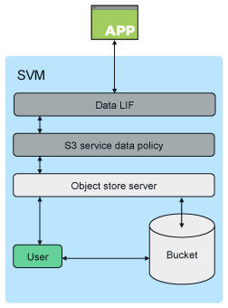

= 있습니다
:allow-uri-read: 
:icons: font
:imagesdir: ../media/

[role="lead"]
ONTAP에서 버킷의 기본 아키텍처는 link:https://docs.netapp.com/us-en/ontap/flexgroup/definition-concept.html["FlexGroup 볼륨"]여러 개의 구성 멤버 볼륨으로 구성되지만 단일 볼륨으로 관리되는 단일 네임스페이스입니다.

image::../media/fg-overview-s3-config.gif[FlexVol 볼륨은 구성 요소라고 하는 FlexGroup 볼륨 그룹으로 표시됩니다]

버킷에 대한 액세스는 승인된 사용자 및 클라이언트 애플리케이션을 통해 제공됩니다.

[NOTE]
====
버킷을 FabricPool 엔드포인트로 사용하는 것을 포함하여 S3 애플리케이션에만 사용할 경우 기본 FlexGroup 볼륨은 S3 프로토콜만 지원합니다.

ONTAP 9.12.1부터는 NAS 프로토콜을 사용하도록 미리 구성된 에서도 S3 프로토콜을 활성화할 수 link:../s3-multiprotocol/index.html["멀티프로토콜 NAS 볼륨"] 있습니다. 멀티프로토콜 NAS 볼륨에서 S3 프로토콜이 활성화된 경우 클라이언트 애플리케이션은 NFS, SMB 및 S3를 사용하여 데이터를 읽고 쓸 수 있습니다.

====

== 버킷 제한

최소 버킷 크기는 95GB입니다. + 최대 버킷 크기는 최대 FlexGroup 크기인 60PB로 제한됩니다.

FlexGroup 볼륨당 버킷 1,000개 또는 클러스터당 버킷 12,000개(FlexGroup 볼륨 12개 사용)로 제한됩니다.

== ONTAP 9.14.1 이상을 사용한 자동 FlexGroup 사이징

ONTAP 9.14.1부터 기본 FlexGroup 크기는 기본 버킷의 크기를 기준으로 합니다. 버킷을 추가하거나 제거하면 FlexGroup 볼륨이 자동으로 증가 또는 감소합니다.

예를 들어 초기 Bucket_A가 100GB로 프로비저닝되면 FlexGroup는 100GB로 씬 프로비저닝됩니다. 300GB의 Bucket_B, 500GB의 Bucket_C라는 두 개의 추가 버킷을 생성하면 FlexGroup 볼륨이 900GB로 증가합니다.

(100GB의 Bucket_A + 300GB의 Bucket_B + 500GB의 Bucket_C = 900GB)

Bucket_A를 삭제하면 기본 FlexGroup 볼륨이 800GB로 줄어듭니다.

== ONTAP 9.13.1 이하 버전에서 기본 FlexGroup 크기가 수정되었습니다

버킷 확장을 위한 용량을 제공하려면 FlexGroup 볼륨에 있는 모든 버킷의 총 사용 용량이 클러스터의 사용 가능한 스토리지 애그리게이트 기준 최대 FlexGroup 볼륨 용량의 33% 미만이어야 합니다. 이 조건을 충족할 수 없으면 새로 생성되는 자동으로 생성된 FlexGroup 볼륨에 새 버킷이 프로비저닝됩니다.

ONTAP 9.14.1 이전 버전에서는 FlexGroup 크기가 환경에 따라 기본 크기로 고정되어 있습니다.

* 1.6PB(ONTAP
* ONTAP Select은 100TB

클러스터의 용량이 기본 크기로 FlexGroup 볼륨을 프로비저닝할 수 없을 경우 ONTAP는 기존 환경에서 프로비저닝할 수 있을 때까지 기본 크기를 절반으로 줄입니다.

예를 들어, 300TB 환경에서 FlexGroup 볼륨은 200TB(1.6PB, 800TB, 400TB FlexGroup 볼륨 크기가 너무 커서 환경에 맞지 않는 경우)로 자동으로 프로비저닝됩니다.
